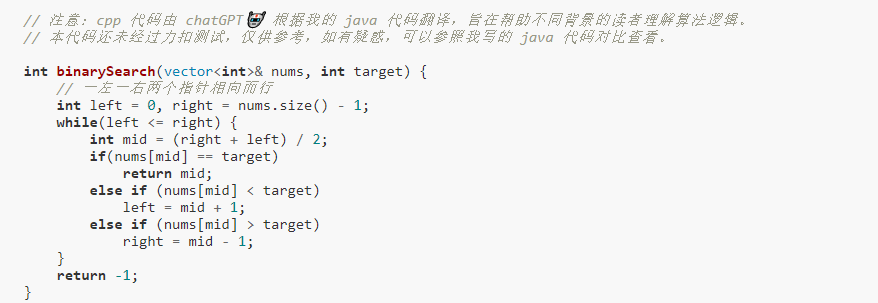
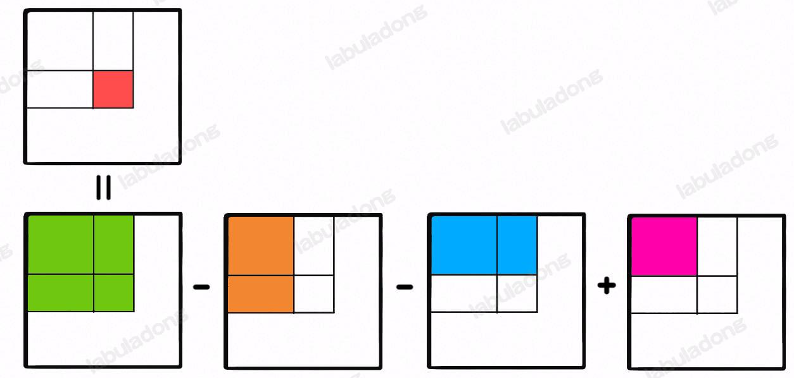
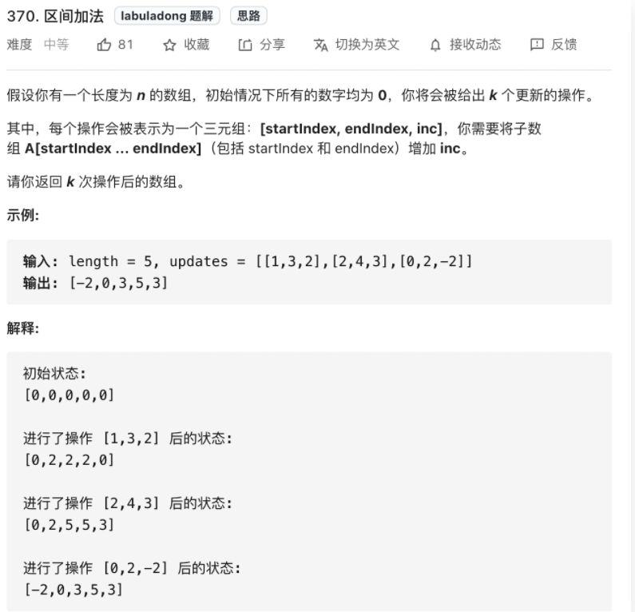
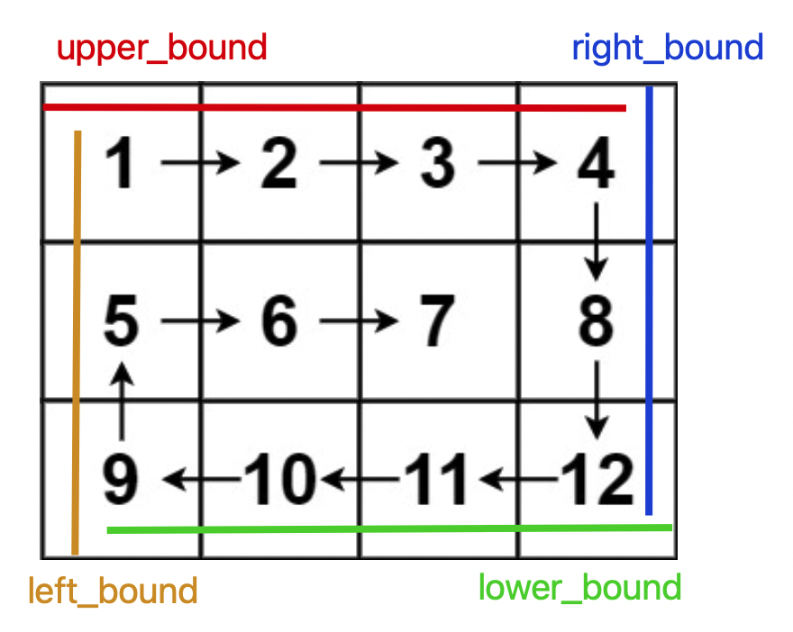
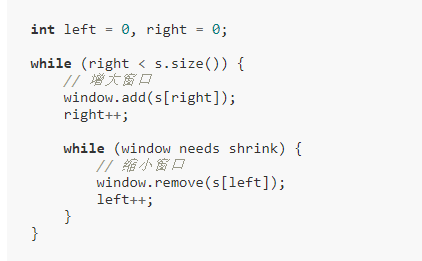
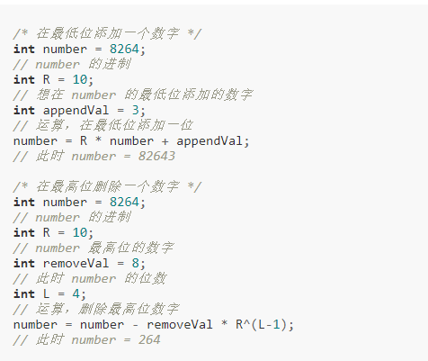

# Array(数组)

vector.resize(n) 当resize n大于原来vector的长度时，末尾补0；当n小于时则截取到前n个
快慢指针： 1.原地修改数组；2.滑动窗口
左右指针：1.二分查找；2.两数之和；3、反转数组4、回文串判断

```
3.22 moveZeroes(283) + removeElement(27)
```
* 快慢指针，因为需要保留原始相对顺序，不能从两端向中间逼近，只能用快慢从前往后遍历
* 为什么返回数值是整数，但输出的答案是数组
请注意，输入数组是以「引用」方式传递的，这意味着在函数里修改输入数组对于调用者是可见的。

```
3.22 twoSum(167) +reverseString(344)
```
* 左右指针的终止条件，左指针 小于右指针


```
3.22 longestPalindrome（5）
```
* 回文串判定：1.两边往中间走，相等；2.从中心往两边走
* 字符长度判定 s.length(), 切割字符string s s.substr(begin, lenth);
* string类是一个保存字符的动态数组，由于其中有一个接口c_str,转化成c语言的字符串，要以\0结尾，所以string类最后会有一个\0.
* vector<T>是一个保存T类型的动态数组，vector<char>也是保存字符的动态数组，但是，不会以\0结尾，不保存\0.


```
3.22Range Sum Query - Immutable 前缀和
```
* 前缀和主要适用的场景是原始数组不会被修改的情况下，频繁查询某个区间的累加和
* sumRange 函数仅仅需要做一次减法运算，避免了每次进行 for 循环调用，最坏时间复杂度为常数 O(1)
* 矩阵
* 

```
3.22 差分数组(1109)
```
* 差分数组的主要适用场景是频繁对原始数组的某个区间的元素进行增减。
* 
* 差分数组类构造函数，初始化全0， increment(i,j,val),  result();
* 注意increment中边界条件，只用修改diff[i] 和 diff[j+1] 如果j+1越界，则不用修改
* for (auto &booking: bookings)写法
* 熟悉一下c++类的构造；


```
3.25 旋转图像(48)
```
* 顺时针旋转图像90：按照左上到右下的对角线进行镜像对称 然后再对矩阵的每一行进行反转：
* 逆时针旋转图像90：按照右上到左下的对角线进行镜像对称 然后再对矩阵的每一行进行反转


```
3.26spiralOrder(54 & 59)
```
* 
* 


```
3.26滑动窗口(76)
```
* 滑动窗口基本思路：增大窗口，从右加入元素；不满足条件，从左缩小窗口
* 

```
3.26minWindow(76) & checkInclusion(567) findAnagrams（438）lengthOfLongestSubstring(3)
```
* window 和need 之间的关系，可以用一个valid数来记录满足的个数 
* right++ 的时候， window对应++， 判断need ==  window时 valid++
* 缩小窗口时，先判断need == window的情况，valid--后再window--；
* vector<int> res; 动态往数组中加元素， res.push_back() 

```
3.27滑动窗口延伸（Rabin-Karp 算法）
```
* 不断向最低位（个位）添加数字，同时把前面的数字整体左移一位（乘以 10）。
* 删除数字的最高位
* 
* unordered_set res; vector<string>(res.begin(), res.end())


```
3.27二分查找
```
* 基本框架，注意越界，边界条件（<= 还是 < ,mid应该加一还是减一）；
* 
* 注意搜索区间（和初始化相关right=n（右开）还是 n-1（右闭）），和while中的终止条件（<= 和<）以及left=mid还是mid+1；以及right = mid还是mid-1密切相关！！！


```
3.27田忌赛马（870）
```
* 将齐王和田忌的马按照战斗力排序，然后按照排名一一对比。如果田忌的马能赢，那就比赛，如果赢不了，那就换个垫底的来送人头，保存实力。
*  auto cmp = [](pair<int,int> left, pair<int,int> right){return (left.second) < (right.second);};
*  priority_queue<pair<int, int>, vector<pair<int, int>>, decltype(cmp)> mq(cmp);
*  优先队列操作，按照第二个元素值排列。


```
3.28常数时间删除-查找数组中的任意元素（380）
```
* 对于常规的hashset不能实现O(1)随机取元素（随机分散到整个数组中，不紧凑）。
* 对数组尾部进行插入和删除操作不会涉及数据搬移，时间复杂度是 O(1)
* 如果我们想在 O(1) 的时间删除数组中的某一个元素 val，可以先把这个元素交换到数组的尾部，然后再 pop 掉。
* vector<int> nums; nums.back()访问数组最后一个元素； nums.push_back()往最后添加元素；nums.pop_back()从向量中删除最后一个元素并将向量的大小减小一。
* rand()

```
3.28黑名单中的随机数（710）
```
* 让几个数取得的概率相等  rand()%size  必须是紧凑的数组；
* 给定整数N，其中有n个黑名单， 则需要一个长度为N-n紧凑数组，可以通过map将在（0，N-n）范围中的黑名单数，映射到(N-n，N)中不在黑名单中的随机数
* 