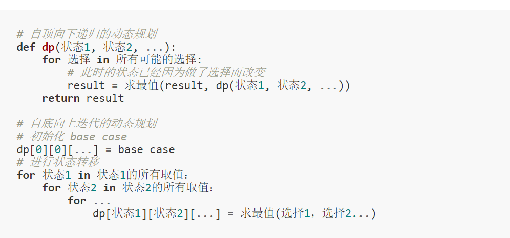
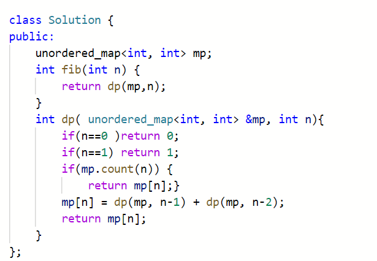
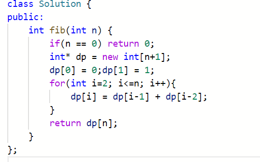
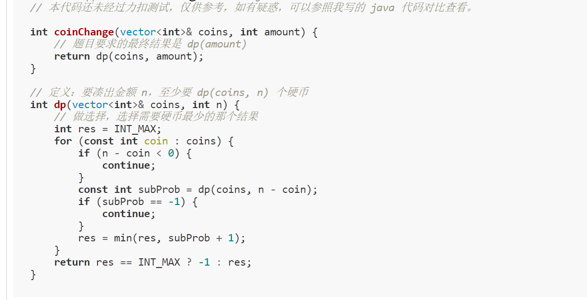
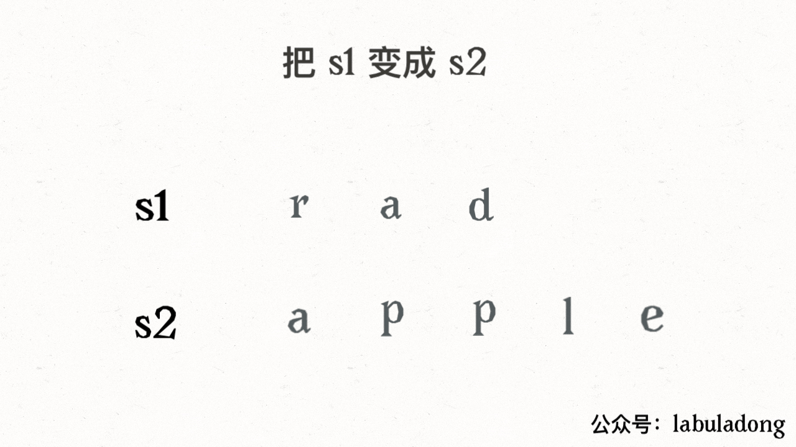

# 动态规划问题（Dynamic Programming）
## 动态规划问题的一般形式就是求最值;
## 求解动态规划的核心问题是穷举;只有列出正确的「状态转移方程」，才能正确地穷举。
## 动态规划问题存在「重叠子问题」
最优子结构性质作为动态规划问题的必要条件，一定是让你求最值的。以后碰到那种恶心人的最值题，思路往动态规划想就对了

dp数组的遍历：
1、遍历的过程中，所需的状态必须是已经计算出来的。

2、遍历结束后，存储结果的那个位置必须已经被计算出来。

动态规划问题穷举的过程中会出现重叠子问题导致的冗余计算，所以前文 动态规划核心套路框架 中告诉你如何一步一步把暴力穷举解法优化成效率更高的动态规划解法。

然而，想要写出暴力解需要依据状态转移方程，状态转移方程是动态规划的解题核心，可不是那么容易想出来的。不过，前文 动态规划设计：数学归纳法 告诉你，思考状态转移方程的一个基本方法是数学归纳法，即明确 dp 函数或数组的定义，然后使用这个定义，从已知的「状态」中推导出未知的「状态」。

```
明确 base case -> 明确「状态」-> 明确「选择」 -> 定义 dp 数组/函数的含义。
```
基本框架
* 


```
3.29斐波那契数(509)
```
* 暴力递归；（状态转移方程递归）  f(n) = f(n-1) + f(n-2);
* 自顶向下递归； （用额外存储 +  递归）、
* 
* 自底向上递推； （用额外存储 +  递推）、
* 


```
3.29凑零钱(322)
```
* 明确 base case -> 明确「状态」-> 明确「选择」 -> 定义 dp 数组/函数的含义。
* 明确 base case: amount=0 时， 算法返回0 不需要任何硬币
* 明确状态： 也就是原问题和子问题中会变化的变量 硬币数量无限且面值固定， 所以发生变化的是 amount
* 明确选择：，导致发生状态变化的行为： 也就是选择硬币，硬币的面值就是选择
* 明确dp函数的定义： 自顶向下：dp是一个递归的函数， 其中的参数就是变化的的量，也就是状态；返回值就是需要计算的量
* 所以我们可以这样定义 dp 函数：dp(n) 表示，输入一个目标金额 n，返回凑出目标金额 n 所需的最少硬币数量。

暴力 + 自顶向下 + 自底向上
* 不过 dp 函数体现在函数参数，而 dp 数组体现在数组索引（自顶向下对应dp函数 + 自底向上dp数组）
* dp数组初始化时候 dp（amount+1， amount+1）因为凑成 amount 金额的硬币数最多只可能等于 amount


```
3.29最长递增子序列(300)
```
* 自底向上递推，数学归纳法，假设dp[i-1]成立的条件下，去推导dp[i]。
* 二分查找法


```
3.29俄罗斯套娃信封问题(354)
```
* 最长递增序列的二维情况
* 先按照w进行升序排列，再按照h进行降序，之后对height进行最长递增子序列即可 （h降序是因为 避免出现w相同时候，不满足条件）
* sort函数的应用  sort(v.begin(), v.end(), [](auto& a, auto&b){return 条件})返回值为真表示符合要求条件（a[0]< b[0] ||(a[0]==b[0]&&a[1]>b[1]) 
  

```
3.29下降路径最小和(931)
```
* 初始化dp数组，判断下一状态是从哪些状态转移而来（遍历的方向和方法）；
* 确定不同选择（自底向上的迭代）
* 注意边界条件，最暴力的解法就是if（）

### 解决两个字符串的动态规划问题，一般都是用两个指针 i, j 分别指向两个字符串的最后，然后一步步往前移动，缩小问题的规模
```
3.29不同的子序列(115)【hard 没想明白！！】
```
* dp函数（递归）定义 f[i][j] 为考虑 s 中 s[i:] 个字符，t 中[j:] 个字符的匹配个数   dp(s,0,t,0) -> dp中的base case 就是到 字符串长度
* dp数组：定义 dp[i][j]存储的是 s[i:]的子序列中t[j:] 出现的个数  return dp[0][0]
* ``` 
  倒序遍历
  if (char[i] == char[j]):dp[i][j] = dp[i + 1][j + 1] + dp[i + 1][j]
  if (char[i] != char[j]):dp[i][j] = dp[i + 1][j + 1]
  ``` 


```
3.30编辑距离(72)【hard】
```
* dp函数定义 返回 s1[0..i] 和 s2[0..j] 的最小编辑距离  dp(s,n-1,t,m-1) -> dp中的base case 以字符串头作为（i = -1 或者 i= 0）作为base case
* 
* dp数组存储 s1[0..i] 和 s2[0..j] 的最小编辑距离
* dp 函数的 base case 是 i, j 等于 -1，而数组索引至少是 0，所以 dp 数组会偏移一位。