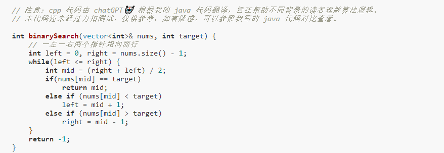

# Linked List（数组类似）
快慢指针： 1.原地修改数组；2.滑动窗口
左右指针：1.二分查找；2.两数之和；3、反转数组4、回文串判断



```
3.13 LRU（hash map + linked list）:
```
* Hash 存储链表节点，链表通过指针修改任意位置；
* LRU从表尾加，表头删，每次使用一次节点就更新对应节点到表尾。

```
3.13 mergeTwoLists(21):
```
* 链表c++中 p = p->next 表示往下移;
* 链接两个链表(p1,p2)只需要将p最后的next赋值给p1(p->next = p1)；
* `虚拟头结点`可以避免处理空指针


```
3.14 deleteDuplicates(83):
```
* 双指针快慢（一般是单链表）处理去重等问题
* 就地删除slow->next = fast (本科读法，fast成为slow的后继，也就是说把slow与fast之间的元素断开了)
* 判定条件一般是所有元素遍历，也就是快指针结束
* 临界条件注意空指针的处理

```
3.14 hasCycle(141):
```
* 判断是否有环可以用快慢指针，快指针每次前进两个，慢指针前进一个，相遇则有环；
* 判断环的起点，则相遇后让一个指针回到起点，然后同步向前，再次相遇则是环起点（设两个指针相遇慢走k，则快走2k[在k步一定是环的整数倍]；环起点在k-m处，则重新指向起点后，再次相遇就是环起点。）
* `注意c++中需要指定返回值的类型，需要匹配！！！`

```
3.14 getIntersectionNode(160):
```
* 双指针同时移动，但是不能保证同时到达交点，拼接构建两个新的单链；
* 暴力解法，可以用`hash`去记录一个表的节点，再和另一个表对比；
* 终止条件是两个指针指向同一节点。

```
3.15 reverseList(206):
```
* 解决递归问题，明确递归函数的定义，本题：输入节点头节点head，翻转以head为头的节点，下一个入口，翻转以head->next为头的链表

* 让head->next->next = head; 断开指向null的指针 使得2->1;
* 再使用head->next = NULL; 使得1->NULL;
  

```
3.15 isPalindrome(234):
```
* 回文的特征是关于中心对称（注意奇偶，奇只有一个中心，偶有两个中心）；
* 判断回文串两种思路：从中心往两边走，从两边往中心走（都可以用双指针）；
* 判断回文链表的难点在于单链表不可逆（递归栈实现倒序和二叉树类似）

* 两种方法：直接逆转单链表即可；找到中点只逆转后半部分（节省空间）；
  
```
3.15 middleNode(876):
```
* 快慢指针，注意奇偶情况在其他算法中的应用；

```
3.22 reverseBetween(92)
```
* 反转链表的一部分 转化为 反转链表前N个节点（通过head->next,left--控制） 进一步转化为反转链表问题（206）
* 递归思想！！！！
* 反转链表前N个节点 注意反转后需要连接的是N+1个节点，考虑base case即 N==1时候，需要用一个外部指针指向next；

```
3.22 reverseKGroup(25)
```
* 反转链表的一部分的迭代方法；

* 避免递归套递归，本体递归+迭代；
* 注意新的链表的起点终点；


```
3.22 moveZeroes(283) + removeElement(27)
```
* 快慢指针，因为需要保留原始相对顺序，不能从两端向中间逼近，只能用快慢从前往后遍历
* 为什么返回数值是整数，但输出的答案是数组
请注意，输入数组是以「引用」方式传递的，这意味着在函数里修改输入数组对于调用者是可见的。

```
3.22 twoSum(167) +reverseString(344)
```
* 左右指针的终止条件，左指针 小于右指针


```
3.22 longestPalindrome（5）
```
* 回文串判定：1.两边往中间走，相等；2.从中心往两边走
* 字符长度判定 s.length(), 切割字符string s s.substr(begin, lenth);
* string类是一个保存字符的动态数组，由于其中有一个接口c_str,转化成c语言的字符串，要以\0结尾，所以string类最后会有一个\0.
* vector<T>是一个保存T类型的动态数组，vector<char>也是保存字符的动态数组，但是，不会以\0结尾，不保存\0.

