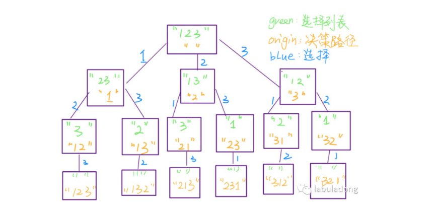
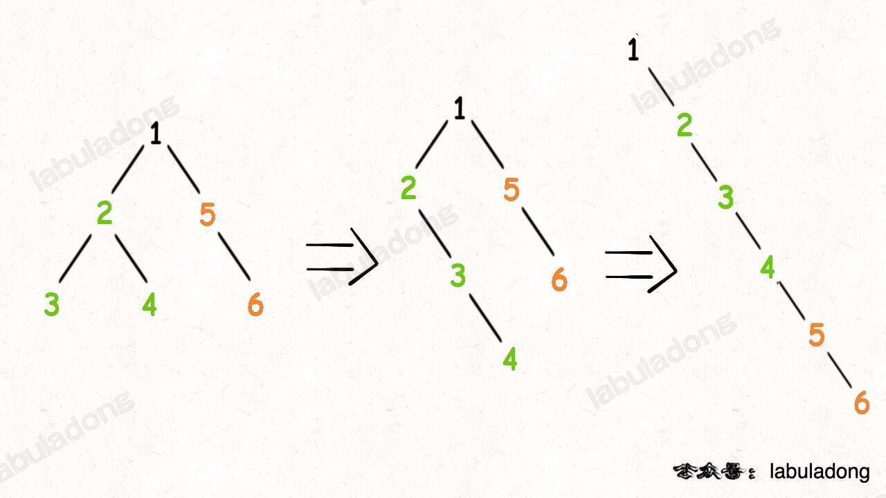
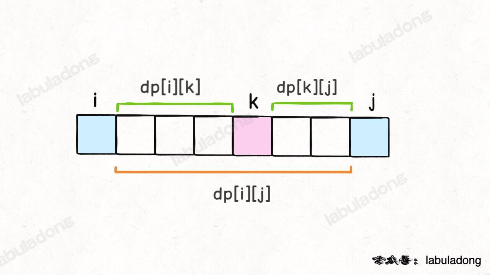
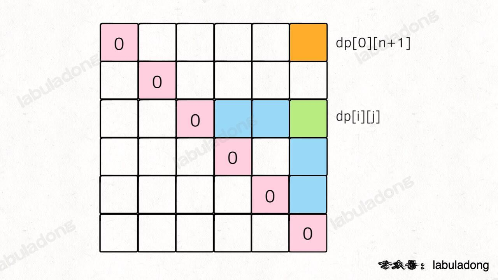

# HOT100重刷
## day 0409
### 1两数之和
hash维护索引：注意对于同一key值后续的值会覆盖， 所以两个相同的值相加的时候应该提前处理
```
    int need = target - nums[i];
    if (index.count(need))
        return vector<int>{index[need], i}; //不在循环中做会导致后一个相同的值覆盖
    index[nums[i]] = i;
```


### 两数之和（2）
1.链表表示两数之和；注意进位的处理；
```
    carry = val / 10;
    val = val % 10;
```
2.终止条件： 两个链表都空且无`进位`所以最后需要判定有无新的进位

##  无重复字符的最长子串（3）
滑动窗口的模式：
```
window[left,right]
left = right = 0
while(right < 边界>){
    window[right] = right;
    right ++;
    while(window[right] 不满足条件){
        window[left] move
        left++
    }

}
```

## day 0413
### 寻找两个正序数组的中位数O(log (m+n))(4)
暴力解法就是重排序两个数组，然后取中位数
log(n)时间复杂度，考虑快排
中位数的定义： 奇数序列为n/2； 偶数序列为第（n/2） + （n+1/2）

1.取较长的二分排序，一次可以确定 m/2个数在中位数左边还是右边


### 最长回文子串(5)
最长回文字串，从中间往两边走,从单个或者两个相同的字母开始
```
string Palindrome(s,i,j){
    while(i>0 && j<s.size() && s[i]==s[j]){
        i--;
        j++
    }
    return s.substr(i+1; j-i-1);
}
```
### 盛水最多容器(11)
双指针

### 三数之和（15）
分解成两数之和
```
string nSum(nums, n, start, target){
    if(n > nums.size() || n<2) return res;
    if(n == 2){
        int sum = nums[left] + nums[right]
        if(sum > target) right--;
        if(sum < target) left++;
        if(sum == target) res.add(left,right);
    }else{
        for(int i = start; i< nums.size(); i++){
            sub = nSum(nums, n-1;i+1,target-nums[i]);
            ##处理结果
        }
    }
}
```
### 电话号码的字母组合（17）
回溯思想！！

```
def backtrack(choicelist, track, answer){
    if(choicelist is empty): answer.add(track);
    for choice in choicelist:
        track.add(choice)
        choicelist.remove(choice)
        backtrack(choicelist, track, answer)
        track.remove(choice)
        choicelist.add(choice)
}
```
解决问题：全排列，组合，子集等问题。


## day 0414
### 19. 删除链表的倒数第 N 个结点
思路简单，双指针，细节处理需要注意；
头节点也算一步， 所以需要用一个虚拟头节点来处理边界更加简单；
```
ListNode * dummy = new ListNode(-1)
dummy ->next = head;
```
好处是倒数第n个是头节点的时候不用特殊处理，可以直接删去。


## day 0420
### 22.括号生成
回溯算法，基础框架
明确choicelist， answer， track，
```
def backtrack(choicelist, track, answer){
    if(choicelist is empty): answer.add(track);
    for choice in choicelist:
        track.add(choice)
        choicelist.remove(choice)
        backtrack(choicelist, track, answer)
        track.remove(choice)
        choicelist.add(choice)
}
```
多个选择的时候，在backtrace函数中先选择一个， 在选择第二个

### 23.合并K个升序链表
合并多次两个链表即可；

### 31.下一个排列
1.从后找到第一个顺序对（相邻的升序） 左边的数；
2.从后往前找第一个比左边的数更大的数，并交换；
3.升序排列左边的数往后的；

排序vector 从某个特定的区间：
```
auto start = vector.begin() + i;
auto end = start + n;
sort(start, end)
```


### 32.最长有效括号字串
最长字串问题，多使用dp算法
括号匹配问题  stack<char>
这里使用了使用索引去方便求取长度。


### 33.搜索旋转排序数组
要求时间复杂度是 $log(n)$ 所以使用二分查找的思想；
每次二分查找会使得整个数组变为一个有序，一个部分有序；
如果target在有序部分就使用二分查找；
target在部分有序则选哟判断
```
if(nums[0] > nums[mid]) //部分有序；
    {
        if(taget<=nums[n-1] && nums[mid] < target) l = mid+1;
        else{
            r = mid -1
        }
    }
```


### 34.在排序数组中查找元素的上下确界
二分查找同一写法：
```
left = 0, right = n-1;
while(left <= right){
    int mid = left = (right - left)/2;
    if(nums[mid] < target) left = mid+1;
    if(nums[mid] > target) right = mid-1;
    if(nums[mid] ==  target){
        right = mid-1; //左边一第一个
        //left = mid+1;  //右边最后一个
    } 
}
```


### 39.组合总和
排列相关问题使用回溯算法，框架：
```
void backtrace(choicelist, trace, res, 条件相关){
    if(满足条件) {
        res.push_back(trace)
        return;
        }
    if(不满足条件) return;
    for(choice in choicelist){
        trace.add(choice)
        choicelist.remove(choice)
        backtrace(choicelist, trace, res, 条件)
        trace.remove(choice)
        choicelist.add(choice)
    }
}
```

### 42.接雨水
思维题， 对于第i个，能接的雨水表示为：
```
water[i] = min(maxheight[0:i-1], maxheight[i+1:n-1]) - height[i]
```
只需要计算包含i在内的左边最大数组，和右边最大数组，然后根据上述定义即可；

### 46.全排列
标准全排列
条件相关： 可以用`trace.size() == num.size()`来衡量
从choiceList中remove 可以用个used bool数组来标记
```
void backtrace(choicelist, trace, res, 条件相关){
    if(满足条件) {
        res.push_back(trace)
        return;
        }
    for (int i = 0; i < nums.size(); i++) {
            // 排除不合法的选择
            if (used[i]) {
                // nums[i] 已经在 track 中，跳过
                continue;
            }
            // 做选择
            track.push_back(nums[i]);
            used[i] = true;
            // 进入下一层决策树
            backtrack(nums, track, used);
            // 取消选择
            track.pop_back();
            used[i] = false;
        }
}
```


### 48 旋转图像
先按照对角线；
在每行 reverse


### 49 字母异位词分组；
数据结构知识：
1.将字母映射成为偏移，并且强制转换数据类型  encode：
```
vector<int> count(26,0)
for (char c:s){
    int delta = c - 'a';
    count[delta] ++;
}
string code(count.begin() count.end());
```
2.unordered_map<type1, type2>遍历方法：
```
for(auto e : mp){
    e.first;  type1
    e.second;  type2
}
```


### 53最大子数组和
动态规划：
dp数组的定义： 以i结尾的最大子数组和为dp[i]； 再去遍历整个dp；
`dp[i] 不能定义成到第i个时，子数组的和最大为dp[i]. 子数组和必须连续，这里可能不连续，不能通过dp[i] 推到出dp[i+1], 同样也不能直接通过dp[n-1]得到结果`


### 55.跳跃游戏
只需要记录第i个各自最远能跳多远即可；
注意边界条件，遇到0的时候怎么处理；
遍历的时候只用遍历nums[n-2]就需要停止；
```
int farest = max(farest, i+nums[i])
if(farest <= i) return false //前面最远都不能到i的下一个，直接失败
```

## day 0423
### 56.合并区间
修改vector<vector< int>中迭代器的元素：
```
* 1利用引用： auto& last = vec[i] last[1] = new vaule   
* 2先pop后再push： auto last = vec[i] res.pop_back(), res.push_back()
```
vector中的最后一个元素： vec.back();
类中定义cmp操作；需要使用static 关键字
cmp定义： bool cmp（type1， type2）

### 62.不同路径
```
vector<vector<int>> memo;
int difpath(int m, int n){
    memo = vector(m,vector<int>(n,0));
    return dp(m-1, n-1);
}
dp(int x, int y){
    if(x ==0 && y == 0) return 1;
    if(x<0 || y< 0) return 0;
    if(memo[x][y] != 0) return memo[x][y];
    memo[x][y] = dp(x-1,y) + dp(x,y-1);
    return memo[x][y];
}
```
### 70.爬楼梯
一维dp： 到第n阶 可以从n-1 和 n-2 到，所以dp[i] = dp[i-1] + dp[i-2]

### 72.编辑距离
二维dp dp函数定义：从s1[0:i] 到s2[0:j]最少需要修改次数；
如果用dp(i，j)表示s1[0:i] 和 s2[0:j] 实际上出现了一次偏移，因为函数入口为dp(i-1,j-1)所以再base case时候需要索引为-1 且 i+1； j+1；
```
    int dp(string &s1, int i, string& s2, int j){
        if(i == -1) return j+1;
        if(j == -1) return i+1;
        ...
    }
```


## day 0424
### 78.子集
注意和全排列的区别
```
    vector<vector<int>> res;
    vector<vector<int>> subsets(vector<int>& nums) {
        // 记录走过的路径
        vector<int> track;
        backtrack(nums, 0, track);
        return res;
    }

    void backtrack(vector<int>& nums, int start, vector<int>& track) {
        res.push_back(track);
        for (int i = start; i < nums.size(); i++) {
            // 做选择
            track.push_back(nums[i]);
            // 回溯
            backtrack(nums, i + 1, track);
            // 撤销选择
            track.pop_back();
        }
    }
```

### 75.颜色分类;
可以先遍历一次数组，将0全部排再数组的左侧，让后从第一个非0数开始，交换1，2位置即可；


## day 0425
### 79.单词搜索
对应问题为 DFS/BFS(岛屿系列问题)
`DFS`深度优先搜索遍历的框架：
```
void traverse(TreeNode *root){
    traverse(root->left);
    traverse(root->right);
}
void dfs(vector<vector<int>>& grid, int i , int j, vector<vector<bool>>& visited){
    int m = grid.size(), n = grid[0].size();
    if(i<0 || j<0 || i>=m || j >= m){
        return;
    }
    if(visited[i][j]){
        return;
    }
    visited[i][j] = true;
    dfs(grid,i-1,j,visited); //上
    dfs(grid,i+1,j,visited); //下
    dfs(grid,i,j-1,visited); //左
    dfs(grid,i,j+1,visited); //右
}
```
注意：使用过后的字符不能继续使用。
```
    void dfs(vector<vector<char>>& board, int i, int j, string word, int p){
        if(p == word.size()){
            found = true;
            return;
        }
        if(found){
            return;
        }
        int m = board.size(), n = board[0].size();
        if (i < 0 || j < 0 || i >= m || j >= n) {  // 在边界之外，返回
            return;
        }
        if(board[i][j] != word[p]){
            return;
        }
        board[i][j] = (char)(-board[i][j]);
        dfs(board, i + 1, j, word, p + 1);  // 向下搜索
        dfs(board, i, j + 1, word, p + 1);  // 向右搜索
        dfs(board, i - 1, j, word, p + 1);  // 向上搜索
        dfs(board, i, j - 1, word, p + 1);  // 向左搜索
        board[i][j] = (char)(-board[i][j]);  // 回溯当前字符
    }
```


## day 0426

### 84.柱状图中最大的矩形
在一维数组中对每一个数找到第一个比自己小的元素。这类“在一维数组中找第一个满足某种条件的数”的场景就是典型的单调栈应用场景。
对于每一个高度，只需要向左向右遍历得到比他小的第一个边界就可以求出对于这个高度最大的面积；
```
stack<int> memo;
vector<int> left;
for(int i=0; i<n; i++){
    while(!memo.empty() && heights[memo.top()] >= heights[i]){
        memo.pop();
    }
    left[i] = (memo.empty() ? -1:memo.top());
    memo.push(i);
}
```

### 85.最大矩形
将二维数组第一层看成一个矩阵，会形成m行柱状图，然后类似于84中的方法解决


### 94.二叉树的中序遍历
注意vector.insert()方法
```
vector.insert(插到位置，插入开始位置，插入结束位置)
res.insert(res.end(), left.begin(), left.end());
```
### 96.不同的二叉搜索树
题目：给你一个整数 n ，求恰由 n 个节点组成且节点值从 1 到 n 互不相同的 二叉搜索树 有多少种？返回满足题意的二叉搜索树的种数。
递归+备忘录解决
递归：以闭区间[1,n]的二叉搜索树；
```
int count(int lo, int hi){
    if(lo > hi){return 1}; //null 也是一种结果
    int res = 0;
    for(int i=lo; i<=hi; i++){
        int left = count(lo, i-1);
        int right = count(i+1, hi);  //以i为根节点的左右二叉搜索树；
        res += left * right;
    }
    return res
}


求所有的二叉搜索树：
List<TreeNode> build(int lo, int hi){
    List<TreeNode> res = new LinkedList<>();
    if(lo > hi){
        res.add(null);
        return res;
    }
    for(int i=lo; i<=hi; i++){
        List<TreeNode> leftTree  = count(lo, i-1);
        List<TreeNode> rightTree  = count(i+1, hi);  //以i为根节点的左右二叉搜索树；
        for(TreeNode left: leftTree){
            for(TreeNode right:rightTree){
                TreeNode root = new Treenode(i);
                root.left = left;
                root.right = right;
                res.add(root);
            }
        }
    }
    return res;
}
```

## day 0428

### 98.验证二叉搜索数
BST 左小右大的特性是指 root.val 要比左子树的所有节点都更大，要比右子树的所有节点都小，你只检查左右两个子节点当然是不够的。正确解法是通过使用辅助函数，增加函数参数列表，在参数中携带额外信息，将这种约束传递给子树的所有节点。
```
bool check(TreeNode* root, TreeNode* minNode, TreeNode* maxNode){
    if(root == nullptr) return true;
    if(minNode != nullptr && root->val <= minNode->val) return false;
    if (maxNode != nullptr && root->val >= maxNode->val) return false;
    return checkValidBST(root->left, minNode, root)
            && checkValidBST(root->right, root, maxNode);
}
```

### 101.对称二叉树
镜像左子树和右子树完全一样，先遍历左子树，再遍历右子树（栈或者递归思想）
```
    bool check(TreeNode *p, TreeNode *q) {
        if (!p && !q) return true;
        if (!p || !q) return false;
        return p->val == q->val && check(p->left, q->right) && check(p->right, q->left);
    }
```

### 二叉树的层次遍历
注意先进先出用queue  queue.front() q.pop()


## day 0429
### 105.从中序遍历和先序遍历构建二叉树
每次确定根节点，左子树的根， 右子树的根

```
    TreeNode* build(vector<int>& preorder, int preStart, int preEnd,
                    vector<int>& inorder, int inStart, int inEnd){
        if(preStart > preEnd){
            return nullptr;
        }
        int rootVal = preorder[preStart];
        int index = valToIndex[rootVal];
        int leftsize = index -inStart;
        TreeNode* root = new TreeNode(rootVal);
        root->left = build(preorder, preStart + 1, preStart + leftsize,
                           inorder, inStart, index - 1);
        root->right = build(preorder, preStart + leftsize + 1, preEnd,
                            inorder, index + 1, inEnd);

        return root;
    }
```


## day 0502
### 114二叉树展开为单链表形式

```
        if (root == nullptr) return;
        // 先递归拉平左右子树
        flatten(root->left);
        flatten(root->right);

        /****后序遍历位置****/
        // 1、左右子树已经被拉平成一条链表
        TreeNode* left = root->left;
        TreeNode* right = root->right;

        // 2、将左子树作为右子树
        root->left = nullptr;
        root->right = left;

        // 3、将原先的右子树接到当前右子树的末端
        TreeNode* p = root;
        while (p->right != nullptr) {
            p = p->right;
        }
        p->right = right;

```

## day 0504 
### 股票买卖问题：动态规划求解
对于dp问题，状态和选择非常重要，对于股票买卖的问题状态有：天数，允许交易次数，持有状态(1，0)
选择有三种：买入，卖出，持有。但是有一定限制买入在卖出之前。
```
状态转移：分为两种，持有和不持有
dp[i][k][0] = max(dp[i-1][k][0], dp[i-1][k][1] + prices[i])
              max(昨天就没有持有， 昨天持有但是今天卖了)
dp[i][k][1] = max(dp[i-1][k][1], dp[i-1][k-1][0] - prices[i])
              max(昨天就持有，昨天每持有今天买进)       
base case：
            dp[-1][...][0] = 0 (因为i是从0开始因此i=-1是dp=0)
            dp[-1][...][1] = -infinity(：还没开始的时候，是不可能持有股票的)
            dp[...][0][0] = 0(因为 k 是从 1 开始的，所以 k = 0 意味着根本不允许交易，这时候利润当然是 0)
            dp[...][0][1] = -infinity(不允许交易的情况下，是不可能持有股票的。)
```
最后返回的是dp[n-1][0]

`121 买股票的最佳时机`
```
class Solution {
public:
    int maxProfit(vector<int>& prices) {
        vector<vector<int>> dp(n,vector<int>(2));
    }
};
```


## day 0505
### 124. 二叉树中的最大路径和
递归思路，但是注意的是需要用辅助函数去递归，在辅助函数中更新结果；
```
    int res = INT_MIN;
    int maxgain(TreeNode* root) {
        if(root == nullptr) return 0;
        int left = maxgain(root->left);
        int right = maxgain(root->right);
        int leftmax = max(0, left);
        int rightmax = max(0, right);

        //结果更新和左右节点有关，如果左右节点为负数则不做贡献；
        int temp = root->val  + leftmax + rightmax;
        res = max(res, temp);
        
        //返回节点的最大贡献值
        return root->val + max(leftmax, rightmax); // 在每个节点中，子节点只能选择一条加入
    }
    int maxPathSum(TreeNode* root) {
        maxgain(root);
        return res;
    }
```

### 128.最长连续序列
* 暴力先排序，然后再遍历，注意相同元素的处理，可以用一个stack来存储连续的数，然后比较最长的stack；
* 用哈希表：
```
unordered_set<int> set;
for(int num: nums){
    set.insert(num);
}
for(int num:set){
    if(set.count(num - 1)){
        continue; // set中存在比当前数小1的数；
    }
    int curNum = num;
    int curLen = 1;
    while(set.count(curNum + 1)){
        curNum += 1;
        curLen += 1; //set中存在比curNum大1的数说明是连续的；
    }
    res = max(res, curLen);
}

```

### 136.只出现一次的数字
一个数和本身做异或运算结果为0； 一个数和0做异或运算结果为本身
```
a ^ a = 0;
a ^ 0 = a;
```


## day 0506
### 139.单词拆分
动态规划的思想：dp函数定义为 返回 s[i..] 是否能够被 wordDict 拼出
```
bool dp(string s, int i, vector<string>& wordDict){
    for(string word : wordDict){
        int len = word.size();
        if(i+len > s.size()) continue;
        if(s.substr(i,len) != word) continue;
        if(dp(s, i+len, wordDict)){
            return true;
        } 
    }
    return false;
}
```

## day 0507
### 141.环形链表
链表是否有环 快慢指针：（注意函数的终止条件）
```
while(fast && fast->next){
    slow = slow->next;
    fast = fast->next->next;
    if(slow == fast) return 1;
}
return 0;
```

### 142.环形链表2
环的长度为K，快比慢多走环的整数倍！ 从头到环的起点和从相遇点到环的起点距离相同；


### 143.LRU缓存
unordered_map 默认从尾部插入
类中 `->` 和 `.` 的区别？
unordered_map.begin() -> first;
unordered_map.erase(key);


## day 0509
### 148.排序链表
暴力： 冒泡排序L:超出时间限制；

官方算法： cut + merge
```
class Solution {
public:
    ListNode* sortList(ListNode* head) {
        return sortList(head, nullptr);
    }

    ListNode* sortList(ListNode* head, ListNode* tail) {
        if (head == nullptr) {
            return head;
        }
        if (head->next == tail) {
            head->next = nullptr;
            return head;
        }
        ListNode* slow = head, *fast = head;
        while (fast != tail) {
            slow = slow->next;
            fast = fast->next;
            if (fast != tail) {
                fast = fast->next;
            }
        }
        ListNode* mid = slow;
        return merge(sortList(head, mid), sortList(mid, tail));
    }

    ListNode* merge(ListNode* head1, ListNode* head2) {
        ListNode* dummyHead = new ListNode(0);
        ListNode* temp = dummyHead, *temp1 = head1, *temp2 = head2;
        while (temp1 != nullptr && temp2 != nullptr) {
            if (temp1->val <= temp2->val) {
                temp->next = temp1;
                temp1 = temp1->next;
            } else {
                temp->next = temp2;
                temp2 = temp2->next;
            }
            temp = temp->next;
        }
        if (temp1 != nullptr) {
            temp->next = temp1;
        } else if (temp2 != nullptr) {
            temp->next = temp2;
        }
        return dummyHead->next;
    }
};
```

偷懒 把值存放在vector中，然后sort调用就行；

### 152.乘积最大子数组
类似于最大子数组和，动态转移方程： dp = max(nums[i], dp[i-1]*nums[i])
但是由于会出现负数，所以需要维护最小值：
```
maxF[i] = max(maxF[i - 1] * nums[i], max(nums[i], minF[i - 1] * nums[i]));
minF[i] = min(minF[i - 1] * nums[i], min(nums[i], maxF[i - 1] * nums[i]));
```


### 155最小栈
用一个辅助栈记录最小值；
每次辅助栈入栈min(top, val)这样每次出栈的时候可以保留当前栈的最小值；

### 160.相交链表
把，A接B 再把B接A

### 169.多数元素
hash表；
众数；

### 198.打家劫舍
动态规划：
不能连续打劫：
dp[i] = max(dp[i+1], dp[i+2]+nums[i])
```
for(int i=n-1; i>=0; i--){
    dp[i] = max(dp[i+1], dp[i+2]+nums[i])
}
return dp[0];
```

### 200.岛屿数量
每次遇到一个陆地，将陆地联通的所有陆地都淹没成为海水；用dfs去遍历图类似
```
dfs(i,j,grid){
    int m = grid.size(), n = grid[0].size();
            if (i < 0 || j < 0 || i >= m || j >= n) {
            // 超出索引边界
            return;
        }
        if (grid[i][j] == '0') {
            // 已经是海水了
            return;
        }
        // 将 (i, j) 变成海水
        grid[i][j] = '0';
        // 淹没上下左右的陆地
        dfs(grid, i + 1, j);
        dfs(grid, i, j + 1);
        dfs(grid, i - 1, j);
        dfs(grid, i, j - 1);
}

```

### 206反转链表
```
reverse(HEAD){
    if(head == null || head->next == null) return head;
    node* last = reverse(head->next);
    head->next->next = head;
    head->next = null;
}
```
进阶反转部分链表：
```
##反转前n个
node* succ;
reverseN(head, int n){
    if(n == 1){
        succ = head->next;
        return head;
    }
    node* last = reverseN(head->next, n-1);
    head->next->next = head;
    head->next = succ;
    return last;
}

################################
反转区间i，j之间
reverseb(node* head, int i, int j){
    if(i = 1){
        return reverseN(head, j);
    }
    head->next = reverseb(head, i-1, j-1);
}
```


### 207课程表：
主要是判断图结构中是否存在环！！！
```
class Solution{
    vector<bool> onPath;
    vector<bool> visited;
    bool hascycle = false;
public:
    bool canfinish(int numcourse, vector<vector<int>>& prerequisites){
        vector<vector<int>> graph = buildGraph(numcourse, prerequisites);
        visited.resize(numCourse, false);
        onPath.resize(numCourses, false);
        for(int i=0; i<numCourse; i++){
            traverse(graph, i);
        }
        return !hascycle;
    }
    void traverse(vector<vector<int>>& graph, int s){
        if(ospath[s]){
            hascycle = true;
        }
        if(visited[s] || hascycle){
            return;
        }
        visited[s] = true;
        onpath[s] = true;
        for(int t:graph[s]){
            traverse(graph,t);
        }
        onpath[s] = false;
    }
    vector<vector<int>> buildGraph(int numCourses, vector<vector<int>>& prerequisites) {
        // 图中共有 numCourses 个节点
        vector<vector<int>> graph(numCourses);
        for (auto edge : prerequisites) {
            int from = edge[1];
            int to = edge[0];
            // 修完课程 from 才能修课程 to
            // 在图中添加一条从 from 指向 to 的有向边
            graph[from].push_back(to);
        }
        return graph;
    }
};

```

## day 0628
### 739每日温度（单调栈）
碰到下一个更大，下一个更小都要考虑单调栈的问题（单调栈里存储的是值还是索引）
```
    for (int i = n - 1; i >= 0; i--) {
        // 判定个子高矮
        while (!s.empty() && s.top() <= nums[i]) {
            // 矮个起开，反正也被挡着了。。。
            s.pop();
        }
        // nums[i] 身后的更大元素
        res[i] = s.empty() ? -1 : s.top();
        s.push(nums[i]);
    }
```

```
class Solution {
public:
    vector<int> dailyTemperatures(vector<int>& temperatures) {
    int n = temperatures.size();
    vector<int> res(n);
    stack<int> s;
    for(int i=n-1;i>=0;i--){
        while(!s.empty() && temperatures[s.top()] <= temperatures[i]){
            s.pop();
        }
        res[i] = s.empty()?0:(s.top() - i)
        s.push(i);
    }
    return res;
    }
};
```

## 0629
### 647回文子串
dp算法：
状态定义： dp[i][j]表示字符串s[i]...s[j]是否为回文串；
状态转移： s[i] == s[j]  ==>>  j-1<=1(表示同一字符或者相邻)  || dp[i+1][j-1] == 1(表示去除首尾是回文)
```
class Solution {
public:
    int res=0;
    int countSubstrings(string s) {
        int n = s.size();
        if(n == 0) return 0;
        vector<vector<int>> dp(n,vector<int>(n,0));
        for(int i=n-1; i>=0; i--){
            for(int j=i; j<n; j++){
                if(s[i]==s[j]){
                    if(j-i<=1 || dp[i+1][j-1]){
                        res ++;
                        dp[i][j] = 1;
                    }
                }
            }
        }
        return res;

    }
};
```

### 621任务调度器
桶思想；时间间隔为n； 每个同的大小为n+1； 
记录最大任务数量 N，看一下任务数量并列最多的任务有多少个，即最后一个桶子的任务数 X，计算 NUM1=(N-1)*(n+1)+x
x计算为`int cnt=1;while(cnt<vec.size()&&vec[cnt]==vec[0]) cnt++;`(只有和最大任务数目相同的任务才能再最后一行填充)
NUM2=tasks.size()
输出其中较大值即可
因为存在空闲时间时肯定是 NUM1 大，不存在空闲时间时肯定是 NUM2>=NUM1
```
class Solution {
public:
    int leastInterval(vector<char>& tasks, int n) {
        vector<int> vec(26);
        for(char c:tasks){
            ++vec[c-'A'];
        }
        int len = tasks.size();
        sort(vec.begin(),vec.end(),[](int& x,int&y){return x>y;});
        int cnt=1;
        while(cnt<vec.size()&&vec[cnt]==vec[0]) cnt++;
        return max(len,cnt+(n+1)*(vec[0]-1) );
    }
};
```
## 0701\
### 287寻找重复数；
思路：因为值特殊，数组有n+1个数，且值在[1，n]之间；
存在index到nums[index]的映射， 有无重复数可以转换时有无环和找到环的入口问题【快慢指着】
```
class solution{
    public：
    int findDuplicate(vector<int>& nums) {
        int slow = 0;
        int fast = 0;
        while(1){
            slow = nums[slow];
            fast = nums[nums[fast]];
            if(slow == fast) break;
        }
        int finder = 0;
        while(1){
            slow = nums[slow];
            finder = nums[finder];
            if(slow == finder) break;
        }
        return finder;
    }
}
```

## 0702
### 297二叉树的序列化和反序列化
将二叉树转存为string，注意分隔符和NULL的处理
反序列化需要注意的是，数据结构，先入先出： queue `q.push();q.frong(); q.pop()`
重构函数，形参不同
注意char 和 string表示 初始化的时候定义char 为单引号''; 定义string时候为双引号"",
char和string不能直接比较 正确：`CHAR == SEP[0]`!!  错误 `CHAR == SEP`
```
class Codec {
public:
    string SEP = ",";
    string NULL_STR = "#";
    // Encodes a tree to a single string.
    string serialize(TreeNode* root) {
        if(!root) return string(NULL_STR) + SEP;
        string res = to_string(root->val) + SEP;
        res += serialize(root->left);
        res += serialize(root->right);
        return res;
    }

    // Decodes your encoded data to tree.
    TreeNode* deserialize(string data) {
        queue<string> nodes;
        string cur = "";
        for(char c:data){
            // cout << c;
            if(c == SEP[0]){
                nodes.push(cur);
                cur = "";
            }else cur += c;
        }
        return deserialize(nodes);
    }

    TreeNode* deserialize(queue<string> &nodes) {
        if(nodes.empty()) return NULL;
        string first = nodes.front(); nodes.pop();
        if(first == NULL_STR) return NULL;
        TreeNode* root = new TreeNode(stoi(first));

        root->left = deserialize(nodes);
        root->right = deserialize(nodes);
        return root;
    }
};
```
## 0719
### 301. 删除无效的括号
采用dfs+剪枝
1.先遍历string 确定需要删除的左括号和右括号
2.然后用删除左括号右括号做条件去搜索合适的解
3.剪枝，不能保留右括号；
```
class Solution {
public:
    unordered_set<string> unique;
    vector<string> removeInvalidParentheses(string s) {
        int l,r;
    #先遍历string 确定需要删除的左括号和右括号
        for(char c: s){
            if(c == '('){
                l ++;
            }if(c == ')'){
                if(l>0){
                    l--;
                }r++;
            }
        }
    #然后用删除左括号右括号做条件去搜索合适的解
    string t = "";
    vector<string> ans;
    dfs(s,t,0,l,r,0,0);
    for(auto s:unique){
        ans.push_back(s);
    }
    return ans
    }
    void dfs(string &s, string &t, int i, intl, int r, int lcnt, int rcnt){
        if(i == s.size()) {
            if(l == 0 && r == 0)unique.insert(t);
            return;
        }
        #删除左括号和右括号，但是需要保证左右括号删除个数满足l,r
        if(s[i] == '(' && l > 0){
            dfs(s,t,i+1,l-1,r,lcnt,rcnt);
        }
        if(s[i] == ')' && r > 0){
            dfs(s,t,i+1,l,r-1,lcnt,rcnt);
        }
        #保留当前字符
        t.push_back(s[i]);
        if(s[i] != '(' && s[i] != ')'){
            dfs(s,t,i+1,l,r,lcnt,rcnt);
        }else if(s[i] == '('){
            dfs(s,t,i+1,l,r,lcnt+1,rcnt);
        }else if(rcnt < lcnt){ #剪枝，只有rcnt<lcnt 时候保留右括号才有意义
            dfs(s,t,i+1,l,r,lcnt,rcnt+1);
        }
        t.pop_back();
    }
}
```

### 309. 最佳买卖股票时机含冷冻期
股票系列问题的状态定义：
dp[i][k][0 or 1] //dp[i][k][2] 
0 <= i <= n - 1, 1 <= k <= K
n 为天数，大 K 为交易数的上限，0 和 1 代表是否持有股票。
状态转移方程：
dp[i][k][0] = max(dp[i-1][k][0], dp[i-1][k][1] + prices[i])
dp[i][k][1] = max(dp[i-1][k][1], dp[i-1][k-1][0] - prices[i])

base case：
dp[-1][...][0] = dp[...][0][0] = 0
dp[-1][...][1] = dp[...][0][1] = -infinity

注意有冻结期的时候，买入要从i-n的时间开始计算
```
class Solution {
public:
    int maxProfit(vector<int>& prices) {
        int n = prices.size();
        vector<vector<int>> dp(n, vector<int>(2));
        for(int i=0; i< n; i++){
            if(i == 0){
                dp[i][0] = 0;
                dp[i][1] = -prices[i];
                continue;
            }
            if(i == 1){
                dp[i][0] = max(dp[i-1][1] + prices[i], dp[i-1][0]);
                dp[i][1] = max(dp[i-1][0]-prices[i], dp[i-1][-1]);
                continue;    
            }
            dp[i][0] = max(dp[i-1][0], dp[i-1][1] + prices[i]);
            dp[i][1] = max(dp[i-1][1], dp[i-2][0]-prices[i]);
        }
        return dp[n-1][0];
    }
};
```

### 312. 戳气球
最值问题的关键就是`枚举`，用回溯枚举所有结果取最值，和用dp使用状态转移枚举；
dp数组定义：
dp[i][j] 表示，戳破气球 i 和气球 j 之间（开区间，不包括 i 和 j）的所有气球，可以获得的最高分数为 x。
base case对象线为0；
要戳破首位，添加虚拟节点-1，n且值为1；
状态转移：
    dp[i][j] = max(dp[i][j],
                    dp[i][k] + dp[k][j] + points[i]*points[k] * points[j])
                    //戳破i-k 和 k-j之后之剩余ijk


如何遍历：
要求的最终态为：dp[0][n+1] 对于所有的dp[i][j]都希望所有的dp[i][k] 和 dp[k][j] 已经被计算，画在图上就是这种情况

所以需要从下往上；从左往右遍历
```
class Solution {
public:
    int maxCoins(vector<int>& nums) {
        int n = nums.size();
        vector<int> points(n + 2);
        points[0] = points[n + 1] = 1;
        for (int i = 1; i <= n; i++) {
            points[i] = nums[i - 1];
        }
        vector<vector<int>> dp(n + 2, vector<int>(n + 2, 0));
        for (int i = n; i >= 0; i--) {
            // j 应该从左往右
            for (int j = i + 1; j < n + 2; j++) {
                // 最后戳破的气球是哪个？
                for (int k = i + 1; k < j; k++) {
                    // 择优做选择
                    dp[i][j] = max(
                            dp[i][j],
                            dp[i][k] + dp[k][j] + points[i] * points[j] * points[k]
                    );
                }
            }
        }
        return dp[0][n + 1];
    }

};
```

### 337. 打家劫舍 III
一维dp dp表示从i开始抢劫的最大收益
自顶向下的dp
```
class Solution {
public:
    unordered_map<TreeNode* , int> memo;
    int rob(TreeNode* root) {
        if(root == nullptr) return 0;
        if(memo.count(root)){
            return memo[root];
        }
        int do_it = root->val + 
                    (root->left == nullptr?0:rob(root->left->left)+rob(root->left->right)) +   
                    (root->right == nullptr?0:rob(root->right->left)+rob(root->right->right));
        int not_do = rob(root->left) + rob(root->right);
        int res = max(do_it,not_do);
        memo[root] = res;
        return res;

    }
};
```

### 322. 零钱兑换
```
class Solution {
public:
    int coinChange(vector<int>& coins, int amount) {
        vector<int> dp(amount+1,amount+1);
        dp[0] = 0;
        // 外层 for 循环在遍历所有状态的所有取值
        for(int i = 1; i<amount+1; i++){
            // 内层 for 循环在求所有选择的最小值
            for(int coin:coins){
                // 子问题无解，跳过
                if(i <coin) continue;
                dp[i] = min(dp[i], dp[i-coin]+1);
            }
        }
        return dp[amount]==amount+1?-1:dp[amount];
    }
};
```

### 338. 比特位计数
奇数比同个数偶数多1 比如`0->0 1->1`
偶数相当于他的一半后添加一个0 比如`1->1;2->10;4->100;` ，`3->11; 6->110,12->1100`,
tips: 判断奇偶可以使用(i & 1)
```
class Solution {
public:
    vector<int> countBits(int n) {
        vector<int> res(n+1);
        res[0] = 0;
        for(int i=1; i<=n; i++){
            if(i & 1 == 1){
                res[i] = res[i-1] +1;
            }else{
                int j = i/2;
                res[i] = res[j];
            }
            
        }
        return res;
    }
};
```
### 347. 前 K 个高频元素
1.采用oredered_map记录每个元素出现频率；
2.用sort方法排序（保存在迭代器中，map需要存成vec）
`sort(vector.begin(), vector.end(), [](pair<int, int>&a, pair<int, int>&b){return a.second>b.second;})`
```
class Solution {
public:
    vector<int> topKFrequent(vector<int>& nums, int k) {
        unordered_map<int,int> map;
        vector<pair<int, int>> vec;
        vector<int> res;
        for(int i : nums){
            map[i]++;
        }    
        for (auto it:map) {
		vec.push_back(it);
	}  
        sort(vec.begin(), vec.end(),[](pair<int, int>&a, pair<int, int>&b) {return a.second>b.second;});
        for(int i=0; i<k; i++){
            pair<int,int> a = vec[i];
            res.push_back(a.first);
        }
        return res;
    }
};
```

### 394. 字符串解码
1.栈的思想，遇到'['就把当前str和num入栈；
2.遇到']'就依次出栈
3.string转int `atoi(times.c_str())`或者 num = num * 10 + s[i] - '0';

```class Solution {
public:
    string decodeString(string s) {
        string strNum = "";
        string strChar = "";
        stack<string> stk;
        for(char c: s){
            if(c <= '9' && c >= '0'){
                strNum += c;
            }
            if (c == '[') {
                stk.push(strNum);
                strNum = "";
                stk.push(strChar);
                strChar = "";
            }
            if (c >= 'a' && c <= 'z') {
                strChar += c;
            }
            if (c == ']') {
                string top = stk.top();
                stk.pop();
                string times = stk.top();
                stk.pop();
                int itimes = atoi(times.c_str());
                for(int j = 0; j < itimes; ++ j)
                    top += strChar;
                strChar = top;
                // cout << strChar << endl;
            }

        }

        return strChar;
    }
};

```

## 0720
### 399. 除法求值
（自己思路）： 构建拓扑结构？map(str,vector<map(vec<str,value>>)) 【不能处理多个串的情况】
(完整思路)：用hashmap建立图正确； 遍历不能直接遍历，而应该用dfs搜索

```
class Solution {
public:
    unordered_map<string,int> visit; 
    vector<double> calcEquation(vector<vector<string>>& equations, vector<double>& values, vector<vector<string>>& queries) {
        unordered_map<string,vector<pair<string,double>>> map;
        int n = equations.size();
        for(int i=0;i<n;i++){
            vector<string> a = equations[i];
            string first = a[0];
            string second = a[1];
            double v = values[i];
            pair<string,double> temp;
            pair<string,double> temp2;
            temp = {second,v};
            temp2= {first,1.0/v};
            map[first].push_back(temp);
            map[second].push_back(temp2);
        }

        vector<double> ans(queries.size(),-1);
        for(int i=0; i<queries.size(); ++i){
            vector<string> ques = queries[i];
            string first = ques[0];
            string second = ques[1];
            double res=-1;
            if(map.count(first)) {
                // for(auto it : map[first]){
                //     cout << it.first <<endl;
                // }
                visit.clear();  //清理上一次查找过的所有根节点
                res=dfs(map,first,second,1);    //每一次访问时不能互相干扰。
            }
            ans[i] = res;
        }
        return ans;
    }
        double dfs(unordered_map<string,vector<pair<string,double>>>& mp,string& a,string &b,double res)
        { //a/b
        //if(mp.count(a)==0) return -1;
        //cout<<a<<endl;
        
        if(a==b) return res;
        double ans=-1;
        if(visit[a]) return ans;   //证明还没以该节点为根进行遍历过
        visit[a]=1;
        for(auto it:mp[a]){
            // cout << it.first << endl;
            ans=dfs(mp,it.first,b,res*it.second);
            if(ans!=-1) break;
        } 
        return ans;
        }
};

```

### 406. 根据身高重建队列
(自己思路):先用sort排序，之后根据前面有多少人排[实现有问题,vector按照位置插值 vector.begin()+index]
(完整思路):vector[0]降序；vector[1]正序` // sort(people.begin(),people.end(),[](auto& a, auto& b){if(a[0] != b[0]) return a[0] > b[0];else return a[1] < b[1];});`
```
class Solution {
public:
    static bool cmp(vector<int>& a, vector<int> &b){
        if(a[0] != b[0]){
             return (a[0] > b[0]);
        }return a[1] < b[1];
    }
    vector<vector<int>> reconstructQueue(vector<vector<int>>& people) {
        int n = people.size();   
        sort(people.begin(),people.end(),cmp);
        vector<vector<int>> res;
        for(auto p:people){
            if(res.size() > p[1]) res.insert(res.begin()+p[1], p);
            else res.push_back(p);
        }
        return res;
    }
};
```

### 437. 路径总和 III
(思路)：递归dfs注意值的范围
```
/**
 * Definition for a binary tree node.
 * struct TreeNode {
 *     int val;
 *     TreeNode *left;
 *     TreeNode *right;
 *     TreeNode() : val(0), left(nullptr), right(nullptr) {}
 *     TreeNode(int x) : val(x), left(nullptr), right(nullptr) {}
 *     TreeNode(int x, TreeNode *left, TreeNode *right) : val(x), left(left), right(right) {}
 * };
 */
class Solution {
public:
    int count = 0;
    int pathSum(TreeNode* root, int targetSum) {
        if(root== nullptr) return 0;
        dfs(root,targetSum);
        pathSum(root->left,targetSum);
        pathSum(root->right,targetSum);
        return count;
    }
    void dfs(TreeNode *root, long sum)
{
    if (!root)
        return;
    sum -= root->val;
    if (sum == 0) //注意不要return,因为不要求到叶节点结束,所以一条路径下面还可能有另一条
        count++;  //如果找到了一个路径全局变量就+1
    dfs(root->left, sum);
    dfs(root->right, sum);
}
};

```

### 438. 找到字符串中所有字母异位词
(思路)：滑动窗口（map映射每个词的频率，指针控制窗口）【超出时间限制】
(思路)：用两个map分别记录需要和已有的window
```
class Solution {
public:
    vector<int> findAnagrams(string s, string p) {
        unordered_map<char, int> need, window;
        for(char c:p){
            need[c] ++;
        }
        int left = 0, right = 0;
        int valid = 0;
        vector<int> res;
        while(right < s.size()){
            char c = s[right];
            right++;
            if(need.count(c)){
                window[c]++;
                if(window[c] == need[c])
                    valid++;
            }
            while(right - left == p.size()){
                if(valid == need.size())
                    res.push_back(left);
                char d = s[left];
                left++;
                if(need.count(d)){
                    if(window[d] == need[d])
                        valid--;
                    window[d]--;
                }
            }
        }
        return res;
    }
};
```

### 448. 找到所有数组中消失的数字
```
class Solution {
public:
    vector<int> findDisappearedNumbers(vector<int>& nums) {
        vector<int> res;
        int n = nums.size();
        sort(nums.begin(),nums.end());
        unordered_set<int> set;
        for(int i:nums){
            set.insert(i);
        }
        for(int i=0; i<n; i++){
            if(!set.count(i+1))
                res.push_back(i+1);
             
        }
        return res;
    }
};
```

### 461. 汉明距离
方法1： 内置函数`__builtin_popcount()`
方法2：s & 1表示检查最后一位是不是1，然后s>>=1
方法3：s &= s - 1;表示删去s最右边的一个1，内次删除次数加1，直到为0
```
方法1：class Solution {
public:
    int hammingDistance(int x, int y) {
        return __builtin_popcount(x ^ y);
    }
};

方法2：class Solution {
public:
    int hammingDistance(int x, int y) {
        int s = x ^ y, ret = 0;
        while (s) {
            ret += s & 1;
            s >>= 1;
        }
        return ret;
    }
};

方法3: class Solution {
public:
    int hammingDistance(int x, int y) {
        int s = x ^ y, ret = 0;
        while (s) {
            s &= s - 1;
            ret++;
        }
        return ret;
    }
};
```
### 494 目标和
（思路回溯）： 可以但是卡在超时的边缘
```
class Solution {
public:
    int count = 0;

    int findTargetSumWays(vector<int>& nums, int target) {
        backtrack(nums, target, 0, 0);
        return count;
    }

    void backtrack(vector<int>& nums, int target, int index, int sum) {
        if (index == nums.size()) {
            if (sum == target) {
                count++;
            }
        } else {
            backtrack(nums, target, index + 1, sum + nums[index]);
            backtrack(nums, target, index + 1, sum - nums[index]);
        }
    }
};
```
（动归）[消除重复子问题]：
```
// 注意：cpp 代码由 chatGPT🤖 根据我的 java 代码翻译，旨在帮助不同背景的读者理解算法逻辑。
// 本代码还未经过力扣测试，仅供参考，如有疑惑，可以参照我写的 java 代码对比查看。

class Solution {
public:
    int findTargetSumWays(vector<int>& nums, int target) {
        if (nums.size() == 0) return 0;
        return dp(nums, 0, target);
    }

private:
    // 备忘录
    unordered_map<string, int> memo;
    int dp(vector<int>& nums, int i, int remain) {
        // base case
        if (i == nums.size()) {
            if (remain == 0) return 1;
            return 0;
        }
        // 把它俩转成字符串才能作为哈希表的键
        string key = to_string(i) + "," + to_string(remain);
        // 避免重复计算
        if (memo.count(key)) {
            return memo[key];
        }
        // 类似递归
        int result = dp(nums, i + 1, remain - nums[i]) + dp(nums, i + 1, remain + nums[i]);
        // 记入备忘录
        memo[key] = result;
        return result;
    }
};

```
## 0721
### 538. 把二叉搜索树转换为累加树
(自己思路)：先找到最右边的节点作为起点，每个值记录回溯；
(正确)：遍历二叉树可以用辅助函数traverse！
```
class Solution {
public:
    int carry;
    TreeNode* convertBST(TreeNode* root) {
        traverse(root);
        return root;
    }
    int sum = 0;
    void traverse(TreeNode* root){
        if(root == nullptr){
            return;
        }
        traverse(root->right);
        sum += root->val;
        root->val = sum;
        traverse(root->left);
    }
};
```
### 543. 二叉树的直径
(二叉树的遍历，递归忘得有点多，需要复习)
思路：二叉树得直径等于左右子树最大深度和，转换为最大深度，并且用全局变量记录最大直径

```
`最大深度`：
int maxdepth(TreeNode* root){
    if(root == nullptr){
        return 0;
    }
    int left = maxdepth(root->left);
    int right = maxdepth(root->right);
    return 1+max(left,right);
}

本题在后序位置更新全局变量:
```/**
 * Definition for a binary tree node.
 * struct TreeNode {
 *     int val;
 *     TreeNode *left;
 *     TreeNode *right;
 *     TreeNode() : val(0), left(nullptr), right(nullptr) {}
 *     TreeNode(int x) : val(x), left(nullptr), right(nullptr) {}
 *     TreeNode(int x, TreeNode *left, TreeNode *right) : val(x), left(left), right(right) {}
 * };
 */
class Solution {
public:
    int max = INT_MIN;
    int diameterOfBinaryTree(TreeNode* root) {

    }
    int maxDepth(TreeNode* root){
        if(root == nullptr){
            return 0;
        }
        int leftmax = maxDepth(root->left);
        int rightmax = maxDepth(root->right);
        max = max(max,leftmax+rightmax);
        return 1+max(leftmax,rightmax);
    }
};
```
### 560. 和为 K 的子数组
(思路)：滑动窗口；（不行因为有负值，left得移动有问题）
（思路）：前缀和加哈希只要已经保存了hash（pre-k）的key 则说明pre-k到pre之间满足子数组和为k
```
class Solution {
public:
    int subarraySum(vector<int>& nums, int k) {
        int n = nums.size();
        unordered_map<int,int> map;
        map[0] = 1;
        int pre = 0;
        int count = 0;
        for(int i=0; i<n; i++){
            pre += nums[i];
            if(map.find(pre-k)!=map.end()){
                count += map[pre-k];
            }
            map[pre]++;
        }
        return count;
    }
};
```

### 581. 最短无序连续子数组
(思路)：排序后找最大索引和最小索引：
```
class Solution {
public:
    int findUnsortedSubarray(vector<int>& nums) {
        vector<int> temp;
        temp = nums;
        sort(temp.begin(),temp.end());
        int res = 0;
        int l=nums.size(),r=-1;
        for(int i=0; i<temp.size(); i++){
            if(nums[i] != temp[i]){
                l = min(i,l);
                r = max(i,r);
            }
        }
        if(l==nums.size()) return 0;
        return r-l+1;
    }
};
```
(O(n)方法)：维护左右边界
```
class Solution {
public:
    int findUnsortedSubarray(vector<int>& nums) {
        int n = nums.size();
        int maxn = INT_MIN, right = -1;
        int minn = INT_MAX, left = -1;
        for (int i = 0; i < n; i++) {
            if (maxn > nums[i]) {
                right = i;
            } else {
                maxn = nums[i];
            }
            if (minn < nums[n - i - 1]) {
                left = n - i - 1;
            } else {
                minn = nums[n - i - 1];
            }
        }
        return right == -1 ? 0 : right - left + 1;
    }
};
```
### 617. 合并二叉树
(思路)：递归不熟悉，不知道怎么处理basecase；
```
class Solution {
public:
    TreeNode* mergeTrees(TreeNode* t1, TreeNode* t2) {
        if (t1 == nullptr) {
            return t2;
        }
        if (t2 == nullptr) {
            return t1;
        }
        TreeNode* merged = new TreeNode(t1->val + t2->val);
        merged->left = mergeTrees(t1->left,t2->left);
        merged->right = mergeTrees(t1->right,t2->right);
        return merged;
    }
};

```
