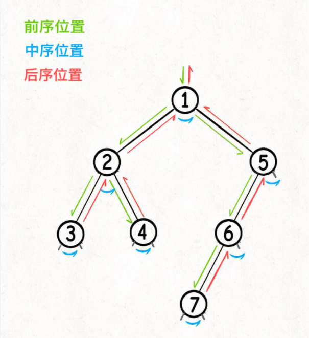
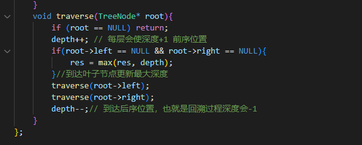

# Tree
```
traverse 是树结构中最重要也是最基础的部分 
void traverse(treenode* root){
    if (root == NULL) return;
    traverse(root->left);
    traverse(root->right);
}
前序等于快排（把整体划分为左边小右边大）
后序等于归并（把两个有序的部分merge到一起）
二叉树问题两个思路：1.遍历一次二叉树（回溯）；2.动态规划
```
```
3.19maxDepth（104）
```
* 两个思路：递归动态规划（分解成为左子树，右子树最大深度）；回溯。（用一个外部变量记录每个节点的深度，取最大值即可）。
* 遍历二叉树会有前序位置，后序位置，中序位置
* 
* 代码中处理位置不同表示位置不同
* 


```
3.19minDepth（111）
```
* 实质是一道BFS(广度优先搜索)，层次遍历(while 控制层，for控制所有同层节点)；
* BFS基本思路，有队列实现，将起点加入，然后当前节点向四周扩散，并将其加入对列。
```
BFS:
int BFS(node strat, node end){
    queue<node> q;
    unordered_set<node> visited;
    if (q == NULL) return 0;
    int step = 0;
    q.push(strat);
    visited.insert(start);
    while(!q.empty()){
        int sz = q.size()
        for (int i=0;i<sz;i++){
            node cur = q.front();
            q.pop()
            if(cur == end) return step;
            for (node n: cur.adj()){
                if (visited.count(x) == 0){
                    q.push(n);
                    visited.insert(n);
                }
            }
        }
        step++;
    }
    return step;
}
```

```
3.19invertTree（226）
```
* 也是两种思路，回溯遍历；递归。
* 回溯方法在辅助函数中，针对每个节点来考虑需要做的操作：交换左右节点；
* 递归，不考虑单个节点，整体左右子树一起考虑。


```
3.19diameterOfBinaryTree（543）
```
* 关键在于每一条二叉树的「直径」长度，就是一个节点的左右子树的最大深度之和。
* 递归和回溯，回溯更优，因为涉及到最大深度，则可能会出现递归套递归问题

```
3.19searchBST（700）
```
* 递归，考虑搜索二叉树左小右大的特点；
  