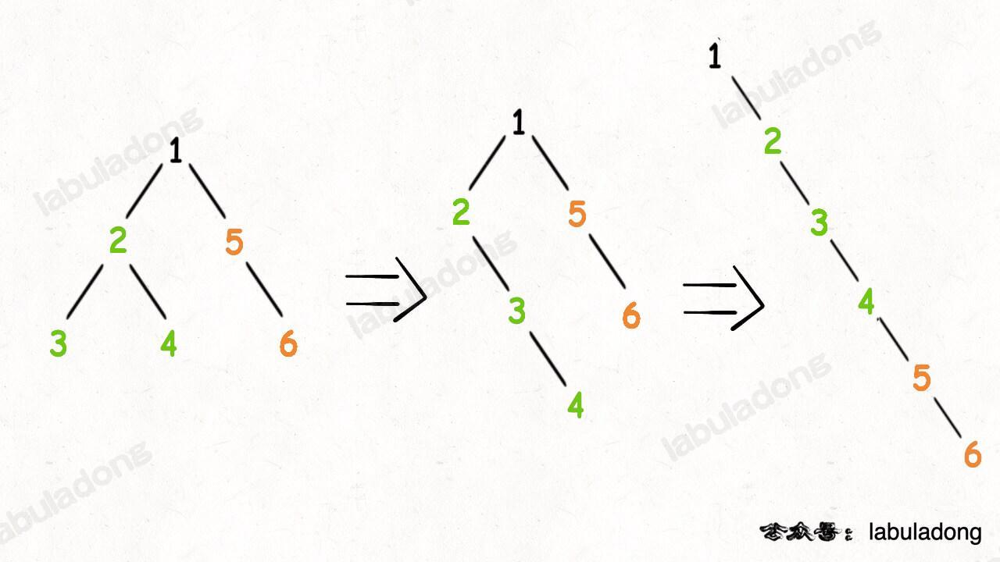

# 数组/字符串
## 7.26
### 合并两个有序数组（88）
思路：原地修改，从后往前；注意处理边界条件
```
class Solution {
public:
    void merge(vector<int>& nums1, int m, vector<int>& nums2, int n) {
        int i= m-1, j= n-1;
        int p = nums1.size() - 1;     
        while(i>=0 && j>=0){
            if(nums1[i] > nums2[j]){
                nums1[p] = nums1[i];
                i--;
                p--;
            }else{
                nums1[p] = nums2[j];
                j--;
                p--;
            }
        }
        while(j>=0){
            nums1[p] = nums2[j];
            j--;
            p--;
        }
    }
};
```

### 27. 移除元素
给你一个数组 nums 和一个值 val，你需要 原地 移除所有数值等于 val 的元素，并返回移除后数组的新长度。
不要使用额外的数组空间，你必须仅使用 O(1) 额外空间并 原地 修改输入数组。
元素的顺序可以改变。你不需要考虑数组中超出新长度后面的元素。
自己的思路：遇到删除的值就和末位交换（边界条件需要考虑清楚，其次可以调用swap函数）
```
class Solution {
public:
    int removeElement(vector<int>& nums, int val) {
        int j = nums.size() - 1;
        for (int i = 0; i <= j; i++) {
            if (nums[i] == val) {
                swap(nums[i], nums[res]);
                i--;
                res--;
            }
        }
        return j + 1;
    }
};
```
正确：快慢指针（原地修改数组，用快指针探路，慢指针存值，删除重复元素类似）；
```
class Solution {
public:
    int removeElement(vector<int>& nums, int val) {
        int slow=0, fast=0;
        while(fast < nums.size()){
            if(nums[fast] != val){
                nums[slow] = nums[fast];
                slow++;
            }
            fast++;
        }
        return slow;
    }
};
```


### 26. 删除有序数组中的重复项
给你一个 升序排列 的数组 nums ，请你 原地 删除重复出现的元素，使每个元素 只出现一次 ，返回删除后数组的新长度。元素的 相对顺序 应该保持 一致 。然后返回 nums 中唯一元素的个数。
原地修改： 快慢指针
`注意边界条件`
```
class Solution {
public:
    int removeDuplicates(vector<int>& nums) {
        int slow=0, fast=0;
        while(fast<nums.size()){
            if(nums[fast] != nums[slow]){
                slow++;
                nums[slow] = nums[fast];
                
            }
            fast++;
        }
        return slow+1;
    }
};
```

### 80. 删除有序数组中的重复项 II
给你一个有序数组 nums ，请你 原地 删除重复出现的元素，使得出现次数超过两次的元素只出现两次 ，返回删除后数组的新长度。
(思路：用一个flag记录出现次数)
```
class Solution {
public:
    int removeDuplicates(vector<int>& nums) {
        int count = 0;
        int slow=0,fast=0;
        while(fast<nums.size()){
            if(nums[slow] != nums[fast]){
                slow++;
                nums[slow] = nums[fast];
            }else if(slow < fast && count<2){
                slow++;
                nums[slow] = nums[fast];
            }
            fast++;
            count++;
            if(fast<nums.size() && nums[fast]!= nums[fast-1]){
                count = 0;
            }
                
        }
        return slow+1;
    }
};
```

### 169. 多数元素
给定一个大小为 n 的数组 nums ，返回其中的多数元素。多数元素是指在数组中出现次数 大于 ⌊ n/2 ⌋ 的元素。
你可以假设数组是非空的，并且给定的数组总是存在多数元素。
(思路：set)
```
class Solution {
public:
    int majorityElement(vector<int>& nums) {
        unordered_map<int,int> mp;
        for(int n:nums){
            mp[n]++;
            if(mp[n]>int(nums.size()/2))
                return n;
        }
        return 0;
    }
};
```

(进阶：粒子的带点性)
```
class Solution {
public:
    int majorityElement(vector<int>& nums) {
        int count = 0;
        int target;
        for(int n:nums){
            if(count == 0){
                target = n;
                count = 1;
            }else if(n == target){
                count++;
            }else{
                count--;
            }
        }
        return target;
    }
};

```
### 189. 轮转数组
给定一个整数数组 nums，将数组中的元素向右轮转 k 个位置，其中 k 是非负数
(思路：迭代器切割,`注意k需要对n取余`)
`vector.assign(begin,end), vector.erase(position),vector.erase(begin,end)`
```
class Solution {
public:
    void rotate(vector<int>& nums, int k) {
        vector<int> temp = nums;
        k = k%nums.size();
        auto left_b = nums.begin();
        auto right = temp.end();
        auto new_b = temp.end()-k;
        nums.insert(left_b,new_b,right);
        nums.erase(nums.end()-k,nums.end());
    }
};
```

(其他思路：三次逆转【全部，前半，后半】)
(其他思路：用全新数组存nums[i + k) % n] = nums[i])
```
class Solution {
public:
    void rotate(vector<int>& nums, int k) {
        int n = nums.size();
        vector<int> newArr(n);
        for (int i = 0; i < n; ++i) {
            newArr[(i + k) % n] = nums[i];
        }
        nums.assign(newArr.begin(), newArr.end());
    }
};
```
## 0727
### 121. 买卖股票的最佳时机
给定一个数组 prices ，它的第 i 个元素 prices[i] 表示一支给定股票第 i 天的价格。
你只能选择 某一天 买入这只股票，并选择在 未来的某一个不同的日子 卖出该股票。设计一个算法来计算你所能获取的最大利润。
返回你可以从这笔交易中获取的最大利润。如果你不能获取任何利润，返回 0 。
(自己思路：一维动态规划，dp[i][1]表示第i天持有股票的最大收益，返回dp[n][0])
`你只能选择某一天买入！！所以dp[i][1] = max(dp[i-1][1],-prices[i])`
```
class Solution {
public:
    int maxProfit(vector<int>& prices) {
        int n = prices.size();
        vector<vector<int>> dp(n,vector<int>(2));
        for(int i=0;i<n;++i){
            if(i == 0){
                dp[i][0] = 0;
                dp[i][1] = -prices[i];
                continue;
            }
            dp[i][0] = max(dp[i-1][0], dp[i-1][1]+prices[i]);
            dp[i][1] = max(dp[i-1][1], -prices[i]);
        }
        return dp[n-1][0];
    }
};
```
### 122. 买卖股票的最佳时机 II
给你一个整数数组 prices ，其中 prices[i] 表示某支股票第 i 天的价格。
在每一天，你可以决定是否购买和/或出售股票。你在任何时候 最多 只能持有 一股 股票。你也可以先购买，然后在 同一天 出售。返回 你能获得的 最大 利润 。
(自己思路：一维动态规划，dp[i][1]表示第i天持有股票的最大收益，返回dp[n][0])
 `可以多次买卖所以dp[i][1] = max(dp[i-1][1], dp[i-1][0]-prices[i])`
 ```
 class Solution {
public:
    int maxProfit(vector<int>& prices) {
        int n = prices.size();
        vector<vector<int>> dp(n,vector<int>(2));
        for(int i=0;i<n;++i){
            if(i == 0){
                dp[i][0] = 0;
                dp[i][1] = -prices[i];
                continue;
            }
            dp[i][0] = max(dp[i-1][0], dp[i-1][1]+prices[i]);
            dp[i][1] = max(dp[i-1][1], dp[i-1][0]-prices[i]);
        }
        return dp[n-1][0];
    }
};
 ```
### 55. 跳跃游戏
给定一个非负整数数组 nums ，你最初位于数组的 第一个下标 。
数组中的每个元素代表你在该位置可以跳跃的最大长度。
判断你是否能够到达最后一个下标
(思路：计算每个位置能到达的最远位置，如果最远位置不能到达当前位置，则false，最后比较最远和size的值)
```
class Solution {
public:
    bool canJump(vector<int>& nums) {
        // vector<int> sup(nums.size());
        if(nums.size()<2) return true;
        int maxdes = nums[0];
        for(int i=1; i<nums.size();++i){
            if(maxdes < i){
                return false;
            }
            maxdes = max(nums[i] + i,maxdes);
        }
        return maxdes>=nums.size()-1;      
        
    }
};
```

### 45. 跳跃游戏 II
给定一个长度为 n 的 0 索引整数数组 nums。初始位置为 nums[0]。
每个元素 nums[i] 表示从索引 i 向前跳转的最大长度。换句话说，如果你在 nums[i] 处，你可以跳转到任意 nums[i + j] 处；
0 <= j <= nums[i] 
i + j < n
返回到达 nums[n - 1] 的最小跳跃次数。生成的测试用例可以到达 nums[n - 1]。
（思路：一维动态规划，dp[i]表示到达i位置最小跳跃次数 `错误：应定义成为：从索引 p 跳到最后一格，至少需要 dp(nums, p) 步`，选择从nums[p]中选择1步，2步等）
（正确思路贪心:每次都跳到最远时再计算次数）：
```
class Solution {
public:
    int jump(vector<int>& nums) {
        int end=0,maxdes=0;
        int n = nums.size();
        int times = 0;
        for(int i=0;i<n-1;++i){
            maxdes = max(nums[i]+i, maxdes);
            if(end == i){
                times++;
                end = maxdes;
            }
        }
        return times;
    }
};
```

### 274. H 指数
给你一个整数数组 citations ，其中 citations[i] 表示研究者的第 i 篇论文被引用的次数。计算并返回该研究者的 h 指数。
根据维基百科上 h 指数的定义：h 代表“高引用次数” ，一名科研人员的 h 指数 是指他（她）至少发表了 h 篇论文，并且每篇论文 至少 被引用 h 次。如果 h 有多种可能的值，h 指数 是其中最大的那个。
（思路：排序+比较定义）
```
class Solution {
public:
    int hIndex(vector<int>& citations) {
        sort(citations.begin(),citations.end());
        int n = citations.size();
        int h=0;
        for(int i =0; i<citations.size();++i){
            int c = min(citations[i], n-i);
            h = max(h,c);
        }
        return h;
    }
};
```

### 380. O(1) 时间插入、删除和获取随机元素
实现RandomizedSet 类：
RandomizedSet() 初始化 RandomizedSet 对象
bool insert(int val) 当元素 val 不存在时，向集合中插入该项，并返回 true ；否则，返回 false 。
bool remove(int val) 当元素 val 存在时，从集合中移除该项，并返回 true ；否则，返回 false 。
int getRandom() 随机返回现有集合中的一项（测试用例保证调用此方法时集合中至少存在一个元素）。每个元素应该有 相同概率 被返回。
你必须实现类的所有函数，并满足每个函数的 平均 时间复杂度为 O(1) 。
(思路：用set实现所有功能)
`迭代器的使用！！！！！！！`
<font color=red>int len = distance(set.begin(), set.end()); //迭代器的长度</font>
<font color=red>auto it = set.begin()</font> ;
<font color=red>advance(it, k); //迭代器步进；</font>

```
class RandomizedSet {
public:
    unordered_set<int> set;
    RandomizedSet() {
        
    }
    
    bool insert(int val) {
        if(set.count(val)){
            return false;
        }else{
            set.insert(val);
        }
        return true;
    }
    
    bool remove(int val) {
        if(set.count(val)){
            set.erase(val);
            return true;
        }
        return false;
    }
    
    int getRandom() {
        int len = distance(set.begin(), set.end());
        // cout << len << endl;
        int k = rand() % (int(len));
        // cout << k << endl;
        auto it = set.begin() ;
        // unordered_set<int>::iterator it= auto(k) + set.begin();
        advance(it, k);
        return *it;
    }
};
```
### 238. 除自身以外数组的乘积
给你一个整数数组 nums，返回 数组 answer ，其中 answer[i] 等于 nums 中除 nums[i] 之外其余各元素的乘积 。
题目数据 保证 数组 nums之中任意元素的全部前缀元素和后缀的乘积都在  32 位 整数范围内。
请不要使用除法，且在 O(n) 时间复杂度内完成此题
(思路类似前缀和，把左边乘积和右边成绩计算出来)
```
class Solution {
public:
    vector<int> productExceptSelf(vector<int>& nums) {
        int n = nums.size();
        vector<int> left(n);
        vector<int> right(n);
        int temp = 1;
        left[0] = 1;
        for(int i=1;i<n;++i){
            left[i] = nums[i-1] * left[i-1];
        }
        right[n-1] = 1;
        for(int i=n-2;i>=0;--i){
            right[i] = nums[i+1] * right[i+1];
        }
        vector<int> answer(n);
        for(int i=0; i<n; ++i){
            answer[i] = left[i] * right[i];
        }
        return answer;
    }
};
```
## 0728
### 134. 加油站
在一条环路上有 n 个加油站，其中第 i 个加油站有汽油 gas[i] 升。
你有一辆油箱容量无限的的汽车，从第 i 个加油站开往第 i+1 个加油站需要消耗汽油 cost[i] 升。你从其中的一个加油站出发，开始时油箱为空。
给定两个整数数组 gas 和 cost ，如果你可以按顺序绕环路行驶一周，则返回出发时加油站的编号，否则返回 -1 。如果存在解，则 保证 它是 唯一 的。
(思路：轮转数组，保证gas之和大于cost之和： 超时了)

正确思路：贪心[先判定总油量是否大于cost，然后保证起始后，油箱中一直有油]
```
class Solution {
public:
    int canCompleteCircuit(vector<int>& gas, vector<int>& cost) {
        // change(gas,cost);
        int n = gas.size();
        int sum = 0;
        for(int i=0;i<n;++i){
            sum += gas[i] - cost[i];
        }
        if(sum <0)
            return -1;
        int start = 0;
        int tank = 0;
        for(int i=0; i<n; ++i){
            tank += gas[i] - cost[i];
            if(tank < 0){
                tank = 0;
                start = i+1;
            }
        }
        return start==n?-1:start;
    }
};
```
### 135. 分发糖果
n 个孩子站成一排。给你一个整数数组 ratings 表示每个孩子的评分。
你需要按照以下要求，给这些孩子分发糖果：
每个孩子至少分配到 1 个糖果。
相邻两个孩子评分更高的孩子会获得更多的糖果。
请你给每个孩子分发糖果，计算并返回需要准备的 最少糖果数目 
(思路：找到最小的值，然后递归)
（正确：两次遍历，左边规则，右边规则，取较大的值）
origin:| 1 | 3 | 2 | 2 | 1 |
left:| 1 | 2 | 1 | 1 | 1 |
right:| 1 | 2 | 1 | 2 | 1 |
res: | 1 | 2 | 1 | 2 | 1 |
```
class Solution {
public:
    int candy(vector<int>& ratings) {
        int n = ratings.size();
        vector<int> left(n);
        for(int i=0;i<n;++i){
            if(i>0 && ratings[i] > ratings[i-1]){
                left[i] = left[i-1] + 1;
            }else{
                left[i] = 1;
            }
        }
        int right = 0, res = 0;
        for(int i=n-1; i>=0; i--){
            if(i<n-1 && ratings[i] > ratings[i+1]){
                right++;
            }else{
                right = 1;
            }
            res += max(left[i], right);
        }
        return res;
    }
};
```
### 42. 接雨水
给定 n 个非负整数表示每个宽度为 1 的柱子的高度图，计算按此排列的柱子，下雨之后能接多少雨水。
(思路，左边，右边)
（每个柱子的储水量等于`min（左最高，右最高） - height[i]`）
```
class Solution {
public:
    int trap(vector<int>& height) {
        int n = height.size();
        vector<int> l_max(n);
        vector<int> r_max(n);
        int res = 0;
        l_max[0] = height[0];
        r_max[n-1] = height[n-1];
        for(int i=1; i<n;++i){
            l_max[i] = max(height[i], l_max[i-1]);
        } 
        for(int i=n-2; i>=0;i--){
            r_max[i] = max(height[i], r_max[i+1]);
        }
        for(int i =1; i<n-1; i++){
            res += min(l_max[i],r_max[i]) - height[i];
        }
        return res;
    }
};
```

### 13. 罗马数字转整数
```
class Solution {
public:
    unordered_map<char, int> map = {
        {'I', 1},
        {'V', 5},
        {'X', 10},
        {'L', 50},
        {'C', 100},
        {'D', 500},
        {'M', 1000},
    };
    int romanToInt(string s) {
        int n = s.size();
        int ans = 0;
        for(int i=0; i<s.size(); i++){
            int value = map[s[i]];
            if(i <n-1 && value < map[s[i+1]]){
                ans -= value;
            }else{
                ans += value;
            }
        }
        return ans;
    }
};
```
### 58. 最后一个单词的长度
给你一个字符串 s，由若干单词组成，单词前后用一些空格字符隔开。返回字符串中 最后一个 单词的长度。
单词 是指仅由字母组成、不包含任何空格字符的最大子字符串。
（思路：for遍历，注意边界时候要重新赋值）
```
class Solution {
public:
    int lengthOfLastWord(string s) {
        int n = s.size();
        string last = "";
        int res;
        for(char c:s){
            if(c != ' '){
                last += c;
            }else if(last != ""){
                res = last.size();
                last = "";
            }
        }
        res = last==""?res:last.size();
        return res;
    }
};
```

### 14. 最长公共前缀
编写一个函数来查找字符串数组中的最长公共前缀。
如果不存在公共前缀，返回空字符串 ""。
```
class Solution {
public:
    string longestCommonPrefix(vector<string>& strs) {
        if (!strs.size()) {
            return "";
        }
        int length = strs[0].size();
        int count = strs.size();
        for (int i = 0; i < length; ++i) {
            char c = strs[0][i];
            for (int j = 1; j < count; ++j) {
                if (i == strs[j].size() || strs[j][i] != c) {
                    return strs[0].substr(0, i);
                }
            }
        }
        return strs[0];
    }
};
```

## 0729
### 151. 反转字符串中的单词
给你一个字符串 s ，请你反转字符串中 单词 的顺序。
单词 是由非空格字符组成的字符串。s 中使用至少一个空格将字符串中的 单词 分隔开。
返回 单词 顺序颠倒且 单词 之间用单个空格连接的结果字符串。
注意：输入字符串 s中可能会存在前导空格、尾随空格或者单词间的多个空格。返回的结果字符串中，单词间应当仅用单个空格分隔，且不包含任何额外的空格。
(思路反转两次)
```
class Solution {
public:
    string reverseWords(string s) {
        vector<string> strs;
        string re_s = reverse(s);
        string temp = "";
        for(char c:re_s){
            if(c != ' '){
                temp += c;
            }else{
                if(temp != ""){
                    strs.push_back(temp);
                    temp = "";
                }
            }
        }
        if(temp != ""){
            strs.push_back(temp);
        }
        string res;

        for(int i=0; i<strs.size();i++){
            string temp = strs[i];
            res += reverse(temp);
            if(i < strs.size()-1){
                res += ' ';
            }
        }
        return res;
    }
    string reverse(string s){
        int n = s.size();
        string res = "";
        for(int i=n-1; i>=0; i--){
            res += s[i];
        }
        return res;
    }
};
```
### 6. N 字形变换
将一个给定字符串 s 根据给定的行数 numRows ，以从上往下、从左到右进行 Z 字形排列
(思路：矩阵存储，然后遍历矩阵 // 或者直接计算位置？)
```
class Solution {
public:
    string convert(string s, int numRows) {
        int n = s.size();
        if(numRows < 2) return s;
        int col = (n/(numRows + numRows-2)+1)*(numRows - 1);
        // cout << col << endl;
        vector<vector<char>> map(numRows,vector<char>(col,' '));
        for(int i=0;i<n;i++){
            int m = (i)/(numRows + numRows-2)*(numRows-1);
            int off = i%(numRows + numRows-2);
            // cout << "m:" << m << ' ' << "off:" << off << ' ' <<"n:"<< numRows<< endl; 
            int index_x,index_y;
            if(off<numRows){
                 index_y = m;
                 index_x = off;
            }else{
                 index_y = m + (off - numRows)+1;
                 index_x = 2* numRows - off - 2;
            }
            cout << index_x << ' ' << index_y << endl;
            // m[]
            map[index_x][index_y] = s[i];
        }
        string res;
        for(int i=0;i<numRows;++i){
            for(int j=0; j<col; ++j){
                char c = map[i][j];
                // m[i][j] = '1';
                // cout << c << endl;
                if(c != ' '){
                    res += c;
                }
            }
        }
        return res;
    }
};
```
### 28. 找出字符串中第一个匹配项的下标
给你两个字符串 haystack 和 needle ，请你在 haystack 字符串中找出 needle 字符串的第一个匹配项的下标（下标从 0 开始）。如果 needle 不是 haystack 的一部分，则返回  -1 。
（思路：切割子串直接比较）
```
class Solution {
public:
    int strStr(string haystack, string needle) {
        int n = haystack.size();
        int m = needle.size();
        int flag = 0;
        while(n>=m){
            if(haystack[0] != needle[0]){
                haystack = haystack.substr(1,n-1);
                flag++;
                n = haystack.size();
            }else{
                string sub = haystack.substr(0,m);
                if(sub==needle){
                    return flag;
                }else{
                    haystack = haystack.substr(1,n-1);
                    flag++;
                    n = haystack.size();
                }
            }
            
        }
        return -1;
    }
};
```
### 68. 文本左右对齐
给定一个单词数组 words 和一个长度 maxWidth ，重新排版单词，使其成为每行恰好有 maxWidth 个字符，且左右两端对齐的文本。
你应该使用 “贪心算法” 来放置给定的单词；也就是说，尽可能多地往每行中放置单词。必要时可用空格 ' ' 填充，使得每行恰好有 maxWidth 个字符。
要求尽可能均匀分配单词间的空格数量。如果某一行单词间的空格不能均匀分配，则左侧放置的空格数要多于右侧的空格数。
文本的最后一行应为左对齐，且单词之间不插入额外的空格。
`fill_n(back_inserter(ans), 1, ' '); back_inserter迭代器末尾 注意和end()区别`
`fill_n(位置，数量，填充元素)`
```
    std::vector<int> v1{ 1, 2, 3, 4, 5, 6};
    std::vector<int> v2{ 1, 2, 3, 4, 5, 6 };

    *(v1.end()-1) = 10;
    *(std::back_inserter(v2)) = 10;

    v1: 1   2       3       4       5       10

    v2: 1   2       3       4       5       6       10
```
```
class Solution {
public:
    string fillWords(vector<string>& words, int bg, int ed, int maxWidth, bool lastLine = false)
    {
        int wordCount = ed - bg + 1;
        int spaceCount = maxWidth + 1 - wordCount;
        for (int i = bg; i <= ed; i++)
        {
            spaceCount -= words[i].size();
        }

        int spaceSuffix = 1;
        int spaceAvg = (wordCount == 1) ? 1 : spaceCount / (wordCount - 1);
        int spaceExtra = (wordCount == 1) ? 0 : spaceCount % (wordCount - 1);

        string ans;
        for (int i = bg; i < ed; i++)
        {
            ans += words[i];
            if (lastLine)
            {
                fill_n(back_inserter(ans), 1, ' ');
                continue;
            }
            fill_n(back_inserter(ans), spaceSuffix + spaceAvg + ((i - bg) < spaceExtra), ' ');
        }
        ans += words[ed];
        fill_n(back_inserter(ans), maxWidth - ans.size(), ' ');
        return ans;
    }

    vector<string> fullJustify(vector<string>& words, int maxWidth) 
    {
        vector<string> ans;
        int cnt = 0;
        int bg = 0;
        for (int i = 0; i < words.size(); i++)
        {
            cnt += words[i].size() + 1;

            if (i + 1 == words.size() || cnt + words[i + 1].size() > maxWidth)
            {
                ans.push_back(fillWords(words, bg, i, maxWidth, i + 1 == words.size()));
                bg = i + 1;
                cnt = 0;
            }
        }
        return ans;
    }
    
};
```
# 双指针
## 7.26
### 125. 验证回文串
如果在将所有大写字符转换为小写字符、并移除所有非字母数字字符之后，短语正着读和反着读都一样。则可以认为该短语是一个 回文串 。
`注意大小写的转化可以用加减法实现c = c-'A'+'a';`
`回文串的判定可以从两边往中间，也可以中间往两边，奇偶的情况可能需要讨论`
```
class Solution {
public:
    bool isPalindrome(string s) {
        string ss = "";
        for(char c:s){
            if(c >= 'a' && c <= 'z'){
                ss += c;
            }
            if(c >= '0' && c <= '9'){
                ss += c;
            }
            if(c >= 'A' && c <= 'Z'){
                c = c-'A'+'a';
                ss += c;
            }
        }
        int i= 0, j= ss.size()-1;
        while(i<j){
            if(ss[i] == ss[j]){
                i++;
                j--;
            }else{
                return false;
            }
        }
        return true;
    }
};
```
### 392. 判断子序列
给定字符串 s 和 t ，判断 s 是否为 t 的子序列。
```
class Solution {
public:
    bool isSubsequence(string s, string t) {
        int i=0,j=0;
        while(i<s.size() && j<t.size()){
            if(s[i] == t[j]){
                i++;
                j++;
            }else{
                j++;
            }
        }
        if(i == s.size()){
            return true;
        }
        return false;
    }
};
```

### 167. 两数之和 II - 输入有序数组
给你一个下标从 1 开始的整数数组 numbers ，该数组已按 非递减顺序排列  ，请你从数组中找出满足相加之和等于目标数 target 的两个数。如果设这两个数分别是 numbers[index1] 和 numbers[index2] ，则 1 <= index1 < index2 <= numbers.length 
以长度为 2 的整数数组 [index1, index2] 的形式返回这两个整数的下标 index1 和 index2。
思路（1.暴力双指针：超时；2：用hash表去存值，但是没有利用输入的性质）
```
class Solution {
public:
    vector<int> twoSum(vector<int>& numbers, int target) {
        int left=0,right=numbers.size()-1;
        vector<int> res(2);
        unordered_map<int, int> mp;
        for(int i=0;i<numbers.size();i++){
            if(mp.count(target-numbers[i])){
                // cout << target-numbers[i] << endl;
                res[0] = mp[target-numbers[i]]+1;
                res[1] = i+1;
                break;
            }else{
                mp[numbers[i]] = i;
            }
        }
        return res;
    }
};
```
左右指针，利用二分查找的思想
```
class Solution {
public:
    vector<int> twoSum(vector<int>& numbers, int target) {
        for (int i = 0; i < numbers.size(); ++i) {
            int low = i + 1, high = numbers.size() - 1;
            while (low <= high) {
                int mid = (high - low) / 2 + low;
                if (numbers[mid] == target - numbers[i]) {
                    return {i + 1, mid + 1};
                } else if (numbers[mid] > target - numbers[i]) {
                    high = mid - 1;
                } else {
                    low = mid + 1;
                }
            }
        }
        return {-1, -1};
    }
};
```


## 0729
### 11. 盛最多水的容器
给定一个长度为 n 的整数数组 height 。有 n 条垂线，第 i 条线的两个端点是 (i, 0) 和 (i, height[i]) 。
找出其中的两条线，使得它们与 x 轴共同构成的容器可以容纳最多的水。
返回容器可以储存的最大水量。
(思路，头尾指针，小的往中间移动，用变量维护最大值)
```
class Solution {
public:
    int maxArea(vector<int>& height) {
        int left = 0, right = height.size()-1;
        int n = height.size();
        int area = 0;
        while(left < right){
            int s = min(height[left],height[right]) * (right-left);
            area = max(s,area);
            if(height[left] < height[right]){
                left++;
            }else{
                right--;
            }
        }
        return area;
    }
};
```

### 15. 三数之和
给你一个整数数组 nums ，判断是否存在三元组 [nums[i], nums[j], nums[k]] 满足 i != j、i != k 且 j != k ，同时还满足 nums[i] + nums[j] + nums[k] == 0 。请
你返回所有和为 0 且不重复的三元组。
注意：答案中不可以包含重复的三元组。
(思路：两数之和的话，排序然后双指针，三数之和，遍历第一个使得剩下两数之和为-nums[i]， 并且排除重复结果)
```
class Solution {
public:
    vector<vector<int>> threeSum(vector<int>& nums) {
        sort(nums.begin(),nums.end());
        int size = nums.size();
        if(size < 3) return {};
        vector<vector<int>> res;
        for(int i=0;i<size;++i){
            if(nums[i]>0) return res;
            if(i>0 && nums[i]== nums[i-1]) continue;
            int left = i+1,right=size-1;
            while(left < right){
                int sum = nums[left] +  nums[right];
                if(sum > -nums[i]){
                    right--;
                }else if(sum < -nums[i]){
                    left++;
                }else{
                    res.push_back({nums[i],nums[left],nums[right]});
                    left++;
                    right--;
                    while(left<right && nums[left] == nums[left-1]) left++;
                    while(left<right && nums[right] == nums[right+1]) right--;
                }
            }
        }
        return res;
    }
};
```

# 滑动窗口
## 0726
### 209. 长度最小的子数组
给定一个含有 n 个正整数的数组和一个正整数 target 。
找出该数组中满足其和 ≥ target 的长度最小的 连续子数组 [numsl, numsl+1, ..., numsr-1, numsr] ，并返回其长度。如果不存在符合条件的子数组，返回 0 。

思路：滑动窗口枚举所有满足条件的子数组，然后用全局变量维护最小长度。
其他思路：因为所有数都是正数，可以尝试使用前缀和+二分查找的方法
```
class Solution {
public:
    int minSubArrayLen(int target, vector<int>& nums) {
        int res=INT_MAX;
        int left=0,right=0;
        int sum = 0;
        while(right < nums.size()){
            sum += nums[right];
            right++;
            if(sum >= target){
                int len = right-left;
                res = min(len+1,res);
                // cout << sum << endl;
                while(sum >= target && left<=right){
                    sum -= nums[left];
                    left++;
                    res = min(right-left+1,res);
                }
            }
        }
        return res==INT_MAX?0:res;

    }
};
```

### 3. 无重复字符的最长子串
给定一个字符串 s ，请你找出其中不含有重复字符的 最长子串 的长度。
思路：用一个set来记录窗口内的字符出现频率，用一个全局变量维护最长长度
`注意一些细节`
```
class Solution {
public:
    int lengthOfLongestSubstring(string s) {
        if(s.size()<1){
            return s.size();
        }
        int res = 1;
        unordered_map<char,int> window;
        int left=0,right=0;
        while(right<s.size()){
            char c = s[right];
            window[c]++;
            while(window[c]>1){
                char d = s[left];
                window[d]--;
                left++;
                res = max(res,right-left+1);
            }
            res = max(res,right-left+1);
            right++;
            
        }
        return res;
    }
};
```

## 0729
### 30. 串联所有单词的子串
给定一个字符串 s 和一个字符串数组 words。 words 中所有字符串 长度相同。
 s 中的 串联子串 是指一个包含  words 中所有字符串以任意顺序排列连接起来的子串。
例如，如果 words = ["ab","cd","ef"]， 那么 "abcdef"， "abefcd"，"cdabef"， "cdefab"，"efabcd"， 和 "efcdab" 都是串联子串。 "acdbef" 不是串联子串，因为他不是任何 words 排列的连接。
返回所有串联子串在 s 中的开始索引。你可以以 任意顺序 返回答案。
（思路：创建hashmap把所有子串都存储，遍历s`[超时]`）
（正确：滑动窗口，以单词为间隔滑动，每次判断窗口内diff的个数，如果differ==0，则满足）
```
class Solution {
public:
    vector<int> findSubstring(string s, vector<string>& words) {
        vector<int> res;
        int m = words.size(),n= words[0].size(),ls = s.size();
        for(int i = 0; i < n && i + m * n <= ls; ++i){
            unordered_map<string, int> differ;
            for(int j=0;j<m;++j){
                ++differ[s.substr(i + j * n, n)];
                // string sub = s.substr(i+j*n,n);
                // differ[sub]++; // s中满足长度后的所有单词
            }
            for(string &word:words){
                differ[word]--;
                if(differ[word] ==  0){
                    differ.erase(word);
                }
                // if(--differ[word] == 0){
                //     differ.erase(word);
                // }
            }
            for(int start=i;start<ls-m*n+1;start+=n){
                if(start!=i){
                    string word = s.substr(start+(m-1)*n,n);//右边的单词加入differ，如果==0就删除
                    differ[word]++;
                    if(differ[word] == 0){
                        differ.erase(word);
                    }
                    // if(++differ[word] == 0){
                    //     differ.erase(word);
                    // } 
                    word = s.substr(start-n,n);//左边的单词删除differ，如果==0就删除
                    differ[word]--;
                    if(differ[word] ==  0){
                        differ.erase(word);
                    }
                    // if(--differ[word] == 0){
                    //     differ.erase(word);
                    // }
                }
                if(differ.empty()){
                    res.emplace_back(start);
                }
            }
        }
        return res;
    }
};
```

### 76. 最小覆盖子串
给你一个字符串 s 、一个字符串 t 。返回 s 中涵盖 t 所有字符的最小子串。如果 s 中不存在涵盖 t 所有字符的子串，则返回空字符串 "" 。
(思路：滑动窗口，用need和valid记录所需要的字母，window更新)
```
class Solution {
public:
    string minWindow(string s, string t) {
        unordered_map<char, int> need, window;
        for (char c : t) need[c]++;
        int left = 0, right = 0;
        int valid = 0;
        int start = 0, len = INT_MAX;
        while(right < s.size()){
            char c = s[right];
            right++;
            if(need.count(c)){
                window[c]++;
                if(window[c] == need[c]){
                    valid++;
                }
            }
            while(valid == need.size()){
                if(right - left < len){
                    start = left;
                    len = right-left;
                }
                char d = s[left];
                left++;
                if(need.count(d)){
                    if(window[d] == need[d]){
                        valid--;
                    }
                    window[d]--;
                }

            }
        }
        return len == INT_MAX ?
                "" : s.substr(start, len);
    }
};
```
# 矩阵
## 0726
### 36. 有效的数独
请你判断一个 9 x 9 的数独是否有效。只需要 根据以下规则 ，验证已经填入的数字是否有效即可。
数字 1-9 在每一行只能出现一次。
数字 1-9 在每一列只能出现一次。
数字 1-9 在每一个以粗实线分隔的 3x3 宫内只能出现一次。（请参考示例图）
(思路：遍历)
```
class Solution {
public:
    bool isValidSudoku(vector<vector<char>>& board) {
        int rows[9][9];
        int columns[9][9];
        int subboxes[3][3][9];
        
        memset(rows,0,sizeof(rows));
        memset(columns,0,sizeof(columns));
        memset(subboxes,0,sizeof(subboxes));
        for (int i = 0; i < 9; i++) {
            for (int j = 0; j < 9; j++) {
                char c = board[i][j];
                if (c != '.') {
                    int index = c - '0' - 1;
                    rows[i][index]++;
                    columns[j][index]++;
                    subboxes[i / 3][j / 3][index]++;
                    if (rows[i][index] > 1 || columns[j][index] > 1 || subboxes[i / 3][j / 3][index] > 1) {
                        return false;
                    }
                }
            }
        }
        return true;
    }
};
```

## 0730
### 54. 螺旋矩阵
给你一个 m 行 n 列的矩阵 matrix ，请按照 顺时针螺旋顺序 ，返回矩阵中的所有元素。
（思路：碰到边界往固定方向走）
```
class Solution {
public:
    vector<int> spiralOrder(vector<vector<int>>& matrix) {
    int m = matrix.size(), n = matrix[0].size();
    int upper_bound = 0, lower_bound = m - 1;
    int left_bound = 0, right_bound = n - 1;
    vector<int> res;
    while (res.size() < m * n) {
        if (upper_bound <= lower_bound) {
            for (int j = left_bound; j <= right_bound; j++) {
                res.push_back(matrix[upper_bound][j]);
            }
            upper_bound++;
        }
        
        if (left_bound <= right_bound) {
            for (int i = upper_bound; i <= lower_bound; i++) {
                res.push_back(matrix[i][right_bound]);
            }
            right_bound--;
        }
        
        if (upper_bound <= lower_bound) {
            for (int j = right_bound; j >= left_bound; j--) {
                res.push_back(matrix[lower_bound][j]);
            }
            lower_bound--;
        }
        
        if (left_bound <= right_bound) {
            for (int i = lower_bound; i >= upper_bound; i--) {
                res.push_back(matrix[i][left_bound]);
            }
            left_bound++;
        }
    }
    return res;
}
};
```
### 48. 旋转图像
给定一个 n × n 的二维矩阵 matrix 表示一个图像。请你将图像顺时针旋转 90 度。
你必须在 原地 旋转图像，这意味着你需要直接修改输入的二维矩阵。请不要 使用另一个矩阵来旋转图像。
(思路：先按照对角线旋转，然后按照行旋转)
```
class Solution {
public:
    void rotate(vector<vector<int>>& matrix) {
        reverse_ij(matrix);
        reverse_i(matrix);
        return;
    }
    void reverse_ij(vector<vector<int>>& matrix){
        int n = matrix.size();
        for(int i=0; i<n;++i){
            for(int j=i; j<n;++j){
                swap(matrix[i][j],matrix[j][i]);
            }
        }
        return;
    }
    void reverse_i(vector<vector<int>>& matrix){
        int n = matrix.size();
        int left, right;
        for(int i=0; i<n; ++i){
            left=0;
            right=n-1;
            while(left<right){
                // cout << left << right<< endl;
                swap(matrix[i][left],matrix[i][right]);
                left++;
                right--;
            }
        }
        return ;
    }
};
```
### 73. 矩阵置零
给定一个 m x n 的矩阵，如果一个元素为 0 ，则将其所在行和列的所有元素都设为 0 。请使用 原地 算法。
(思路，用额外数组存取值为0的坐标，然后set0)
```
class Solution {
public:
    void setZeroes(vector<vector<int>>& matrix) {
        int m = matrix.size(), n = matrix[0].size();
        vector<pair<int,int>> mp;
        for(int i=0; i<m; i++){
            for(int j=0; j<n; j++){
                if(matrix[i][j] == 0){
                    // set(matrix,i,j);
                    mp.push_back({i,j});
                }else{
                    continue;
                }
            }
        }
        for(auto p:mp){
            int i = p.first;
            int j = p.second;
            set(matrix,i,j);
        }
    }
    void set(vector<vector<int>>& matrix, int col ,int row){
       int m = matrix.size(),n = matrix[0].size();
       for(int i=0; i<m;i++){
           matrix[i][row] = 0;
       } 
       for(int j=0; j<n; ++j){
           matrix[col][j] = 0;
       }
       return;
    }
};
```
### 289. 生命游戏
```
class Solution {
public:
    void gameOfLife(vector<vector<int>>& board) {
        int neighbors[3] = {0, 1, -1};

        int rows = board.size();
        int cols = board[0].size();

        // 创建复制数组 copyBoard
        vector<vector<int> >copyBoard(rows, vector<int>(cols, 0));

        // 从原数组复制一份到 copyBoard 中
        for (int row = 0; row < rows; row++) {
            for (int col = 0; col < cols; col++) {
                copyBoard[row][col] = board[row][col];
            }
        }

        // 遍历面板每一个格子里的细胞
        for (int row = 0; row < rows; row++) {
            for (int col = 0; col < cols; col++) {

                // 对于每一个细胞统计其八个相邻位置里的活细胞数量
                int liveNeighbors = 0;

                for (int i = 0; i < 3; i++) {
                    for (int j = 0; j < 3; j++) {

                        if (!(neighbors[i] == 0 && neighbors[j] == 0)) {
                            int r = (row + neighbors[i]);
                            int c = (col + neighbors[j]);

                            // 查看相邻的细胞是否是活细胞
                            if ((r < rows && r >= 0) && (c < cols && c >= 0) && (copyBoard[r][c] == 1)) {
                                liveNeighbors += 1;
                            }
                        }
                    }
                }

                // 规则 1 或规则 3      
                if ((copyBoard[row][col] == 1) && (liveNeighbors < 2 || liveNeighbors > 3)) {
                    board[row][col] = 0;
                }
                // 规则 4
                if (copyBoard[row][col] == 0 && liveNeighbors == 3) {
                    board[row][col] = 1;
                }
            }
        }
    }
};

```

# 哈希表
## 0726
### 383. 赎金信
你两个字符串：ransomNote 和 magazine ，判断 ransomNote 能不能由 magazine 里面的字符构成。
如果可以，返回 true ；否则返回 false 。
（思路）：hash表记录出现的元素，验证
```
class Solution {
public:
    bool canConstruct(string ransomNote, string magazine) {
        unordered_map<char,int> mp;
        for(char c:magazine){
            mp[c]++;
        }
        for(char c:ransomNote){
            if(mp[c] == 0)
                return false;
            mp[c]--;
        }
        return true;
    }
};
```

### 205. 同构字符串
给定两个字符串 s 和 t ，判断它们是否是同构的。
如果 s 中的字符可以按某种映射关系替换得到 t ，那么这两个字符串是同构的。
每个出现的字符都应当映射到另一个字符，同时不改变字符的顺序。不同字符不能映射到同一个字符上，相同字符只能映射到同一个字符上，字符可以映射到自己本身。
(用两个mp分别记录a->b,b->a的映射)
```
class Solution {
public:
    bool isIsomorphic(string s, string t) {
        unordered_map<char,char> mp;
        unordered_map<char,char> mp2;
        for(int i=0;i<s.size();++i){
            char c = s[i];
            char d = t[i];
            if(!mp.count(c) && !mp2.count(d)){
                mp[c] = d;
                mp2[d] = c;
            }else{
                if(mp[c] != d || mp2[d] != c)
                    return false;
            }
        }
        return true;
    }
};
```

### 290. 单词规律
给定一种规律 pattern 和一个字符串 s ，判断 s 是否遵循相同的规律。
这里的 遵循 指完全匹配，例如， pattern 里的每个字母和字符串 s 中的每个非空单词之间存在着双向连接的对应规律。
(用两个mp记录映射关系)
```
class Solution {
public:
    bool wordPattern(string pattern, string s) {
        vector<string> ss;
        string temp = "";
       for (int i = 0; i < s.size(); i++) {
            if (s[i] == ' ') {
                ss.push_back(temp);
                temp = "";
            } else {
                temp += s[i];
            }
        }
        ss.push_back(temp);

        unordered_map<char,string> p2s;
        unordered_set<string> set;
        if (pattern.size() != ss.size()) {
            return false;
        }
        for(int i=0;i<pattern.size();++i){
            if(!p2s.count(pattern[i])){
                if(set.count(ss[i])){
                    return false;
                }
                p2s[pattern[i]] = ss[i];
                set.insert(ss[i]);
            }else{
                if(p2s[pattern[i]] != ss[i])
                    return false;
            }
        }
        return true;
    }
};

```

### 242. 有效的字母异位词
给定两个字符串 s 和 t ，编写一个函数来判断 t 是否是 s 的字母异位词。
注意：若 s 和 t 中每个字符出现的次数都相同，则称 s 和 t 互为字母异位词。

 (思路，hash map存，判断最后是否为空)
 ```
class Solution {
public:
    bool isAnagram(string s, string t) {
        unordered_map<char,int> mp;
        for(char c:s){
            mp[c]++;
        }
        for(char c:t){
            if(!mp.count(c)){
                return false;
            }else{
                mp[c]--;
                if(mp[c]==0){
                    mp.erase(c);
                }
            }
        }
        if(mp.begin() != mp.end()){
            return false;
        }
        
        return 1;
    }
};
 ```
`优化方法，encode用数组记录每个字符出现次数`
```
class Solution {
public:
    // 判断字符串 s 和 t 是否为字母异位词
    bool isAnagram(string s, string t) {
        // 使用 encode 函数计算两个字符串中各字符出现的次数
        vector<int> count1 = encode(s);
        vector<int> count2 = encode(t);
        // 判断两个字符串中所有字符出现的数量是否相同
        for (int i = 0; i < count1.size(); i++) {
            if (count1[i] != count2[i]) {
                return false;
            }
        }
        return true;
    }

    // 计算字符串中各字符出现的次数
    vector<int> encode(string s) {
        vector<int> count(26,0);
        for (char c : s) {
            int delta = c - 'a';
            count[delta]++;
        }
        return count;
    }
};
```

## 0730
### 49. 字母异位词分组
给你一个字符串数组，请你将 字母异位词 组合在一起。可以按任意顺序返回结果列表。
字母异位词 是由重新排列源单词的所有字母得到的一个新单词
（思路：把每个字符串encode，然后再用hash存储encode: encode的方式：大于10可能会出错）
```
class Solution {
public:
    vector<vector<string>> groupAnagrams(vector<string>& strs) {
        vector<vector<string>> res;
        unordered_map<string, vector<string>> mp;
        for(string s:strs){
            string key = encode(s);
            cout << key << endl;
            mp[key].push_back(s);
        }
        // for(auto m:mp){
        //     cout << m.first << endl;
        // }
        for(auto m:mp){
            res.push_back(m.second);
        }
        
        return res;
    }
    string encode(string s){
        vector<int> code(26,0);
        for(char c:s){
            int len = c - 'a';
            code[len]++;
        }
        string res = "";
        for(auto c:code){
            if(c>=10){
                res += (c-10) + 'A';
            }else{
                res += to_string(c);
            }
            
        }
        return res;
    }
};
```
（思路：可以把值sort之后，直接当如encode的值）
```
class Solution {
public:
    vector<vector<string>> groupAnagrams(vector<string>& strs) {
        unordered_map<string, vector<string>> mp;
        for (string& str: strs) {
            string key = str;
            sort(key.begin(), key.end());
            mp[key].emplace_back(str);
        }
        vector<vector<string>> ans;
        for (auto it = mp.begin(); it != mp.end(); ++it) {
            ans.emplace_back(it->second);
        }
        return ans;
    }
};
```
### 1. 两数之和
给定一个整数数组 nums 和一个整数目标值 target，请你在该数组中找出 和为目标值 target  的那 两个 整数，并返回它们的数组下标。
```
class Solution {
public:
    vector<int> twoSum(vector<int>& nums, int target) {
        unordered_map<int,int> index;
        for(int i=0;i<nums.size();i++){
            int d = nums[i];
            if(index.count(target-d)){
                return {index[target-d],i};
            }else{
                index[d] = i;
            }
        }
        return {};
    }
};
```

### 202. 快乐数
编写一个算法来判断一个数 n 是不是快乐数。
「快乐数」 定义为：
对于一个正整数，每一次将该数替换为它每个位置上的数字的平方和。
然后重复这个过程直到这个数变为 1，也可能是 无限循环 但始终变不到 1。
如果这个过程 结果为 1，那么这个数就是快乐数。
如果 n 是 快乐数 就返回 true ；不是，则返回 false 。
(思路：用map记录已经存过的值，如果重复了就陷入循环)
```
class Solution {
public:
    unordered_map<int,int> mp;
    bool isHappy(int n) {
        if(n == 1){
            return true;
        }
        if(mp.count(n)){
            return false;
        }
        // if(n<10) return false;
        if(n == 1) return true;
        int val = getval(n);
        mp[n] = val;
        return isHappy(val);
        

    }
    int getval(int n){
        string s = to_string(n);
        int res = 0;
        for(auto c: s){
            int i = c - '0';
            res += i * i;
        }
        return res;
    }
};
```
### 219. 存在重复元素 II
给你一个整数数组 nums 和一个整数 k ，判断数组中是否存在两个 不同的索引 i 和 j ，满足 nums[i] == nums[j] 且 abs(i - j) <= k 。如果存在，返回 true ；否则，返回 false 。
（思路：用hash表记录上一个相同元素的索引，注意覆盖最新的索引）
```
class Solution {
public:
    bool containsNearbyDuplicate(vector<int>& nums, int k) {
        int n = nums.size();
        unordered_map<int,int> index;
        for(int i=0; i<n; ++i){
            int d = nums[i];
            if(index.count(d)){
                cout << index[d] << endl;
                if(abs(index[d] - i)<= k){
                    // cout << index[d] << endl;
                    // cout << i << endl;
                    return true;
                }else{
                    index[d] = i;
                    continue;
                }
            }else{
                index[d] = i;
            }

        }
        return false;
    }
};
```
### 128. 最长连续序列
给定一个未排序的整数数组 nums ，找出数字连续的最长序列（不要求序列元素在原数组中连续）的长度。
请你设计并实现时间复杂度为 O(n) 的算法解决此问题。
(思路：set存储，`set.count(num-1)说明不是起点，则继续找起点，找到起点后while(set.count(起点+1))`)
```
class Solution {
public:
    int longestConsecutive(vector<int>& nums) {
        int n=nums.size();
        int res = 0;
        unordered_set<int> set;
        for(int i= 0; i<n;++i){
            int d = nums[i];
            if(!set.count(d)){
                set.insert(d);
            }
        }
        for (int num : set) {
            if (set.count(num - 1)) {
                continue;
            }
            int curNum = num;
            int curLen = 1;
            while (set.count(curNum + 1)) {
                curNum += 1;
                curLen += 1;
            }
            res = max(res, curLen);
        }
        return res;
    }
};
```
# 区间
## 0726
### 228. 汇总区间
给定一个  无重复元素 的 有序 整数数组 nums 。
返回 恰好覆盖数组中所有数字 的 最小有序 区间范围列表 。也就是说，nums 的每个元素都恰好被某个区间范围所覆盖，并且不存在属于某个范围但不属于 nums 的数字 x
```
class Solution {
public:
    vector<string> summaryRanges(vector<int>& nums) {
        int n = nums.size();
        int i = 0;
        unordered_set<int> set;
        vector<string> res;
        while(i<n){
            int low =i;
            i++;
            while(i<n && nums[i] == nums[i-1]+1){
                i++;
            }
            int high = i-1;
            string temp = to_string(nums[low]);
            if(low<high){
                temp.append("->");
                temp += to_string(nums[high]);
            }
            res.push_back(move(temp));
        }
        return res;
    }
};
```
## 0731
### 56. 合并区间
以数组 intervals 表示若干个区间的集合，其中单个区间为 intervals[i] = [starti, endi] 。请你合并所有重叠的区间，并返回 一个不重叠的区间数组，该数组需恰好覆盖输入中的所有区间 。
(思路：排序区间，第一个升序，第二个降序，然后遍历)
```
class Solution {
public:
    vector<vector<int>> merge(vector<vector<int>>& intervals) {
        sort(intervals.begin(),intervals.end(),[](auto &a,auto &b){
            if(a[0] != b[0]){
                return a[0] < b[0];
            }else{
                return a[1] < b[1];
            }
        });
        vector<vector<int>> res;
        int left = intervals[0][0];
        int right = intervals[0][1];
        auto it = intervals.begin();
        advance(it,1);
        for(; it!=intervals.end();it++){
            int a = (*it)[0];
            int b = (*it)[1];
            if(right >= a){
                if(right <= b)
                    right = b;
            }else{
                res.push_back({left,right});
                left = a;
                right = b;
            }
           
        }
        res.push_back({left,right});
        return res;
    }
};
```
### 57. 插入区间
给你一个 无重叠的 ，按照区间起始端点排序的区间列表。
在列表中插入一个新的区间，你需要确保列表中的区间仍然有序且不重叠（如果有必要的话，可以合并区间）。
(暴力思路：**直接插入，然后重排序**)
```
class Solution {
public:
    vector<vector<int>> insert(vector<vector<int>>& intervals, vector<int>& newInterval) {
        intervals.push_back(newInterval);
        vector<vector<int>> res;
        sort(intervals.begin(),intervals.end());
        for(auto it :intervals){
            int L=it[0],R=it[1];
            if(!res.size()||res.back()[1]<L){
                res.push_back({L,R});
            }
            else{
                res.back()[1] = max(res.back()[1], R); //每次都更新最大右边界
            }
        }
        return res;
    }
};
```
### 452. 用最少数量的箭引爆气球
有一些球形气球贴在一堵用 XY 平面表示的墙面上。墙面上的气球记录在整数数组 points ，其中points[i] = [xstart, xend] 表示水平直径在 xstart 和 xend之间的气球。你不知道气球的确切 y 坐标。
一支弓箭可以沿着 x 轴从不同点 完全垂直 地射出。在坐标 x 处射出一支箭，若有一个气球的直径的开始和结束坐标为 xstart，xend， 且满足  xstart ≤ x ≤ xend，则该气球会被 引爆 。可以射出的弓箭的数量 没有限制 。 弓箭一旦被射出之后，可以无限地前进。
给你一个数组 points ，返回引爆所有气球所必须射出的 最小 弓箭数 。
（思路：保留区间的交集）
```
class Solution {
public:
    int findMinArrowShots(vector<vector<int>>& points) {
        vector<vector<int>> res;
        sort(points.begin(),points.end());
        for(auto it : points){
            int L = it[0], R = it[1];
            if(!res.size() || res.back()[1] < L){
                res.push_back({L,R});
            }
            else{
                res.back()[1] = min(res.back()[1],R);
                res.back()[0] = max(res.back()[0],L);
            }
        }
        // for(auto it:res){
        //     cout<<it[0] << it[1] << endl;
        // }
        return res.size();
    }
};
```

# 栈
## 0731
### 20. 有效的括号
给定一个只包括 '('，')'，'{'，'}'，'['，']' 的字符串 s ，判断字符串是否有效。
有效字符串需满足：
左括号必须用相同类型的右括号闭合。
左括号必须以正确的顺序闭合。
每个右括号都有一个对应的相同类型的左括号。
(思路：用栈来匹配,`注意stk.top()在没有empty的时候会报错！`)
```
class Solution {
public:
    bool isValid(string s) {
        stack<char> stk;
        for(char c:s){
            if(c == ')'){
                if(stk.empty() || stk.top() != '(')
                    return false;
                else{
                    stk.pop();
                    continue;
                }
            }
            if(c == '}'){
                // cout << stk.top() << endl;
                if( stk.empty() ||stk.top() != '{')
                    return false;
                else{
                    // cout << stk.top() << endl;
                    stk.pop();
                    continue;
                    // cout << stk.top() << endl;

                }
            }
            if(c == ']'){
                if(stk.empty() || stk.top() != '[')
                    return false;
                else{
                    stk.pop();
                    continue;
                }
            }
            else{
                stk.push(c);
            }
            // cout << stk.size()<< endl;
        }
        // cout << stk.top() << endl;
        return stk.empty();
    }
    
};
```
### 71. 简化路径
（思路：以'/'分隔字符串，遇到'..'把最顶的元素移除，最终拼接结果）
```
class Solution {
public:
    string simplifyPath(string path) {
        vector<string> parts;
        int start = 0;
        for (int i = 1; i <= path.size(); ++i) {
            if (path[i] == '/' || i == path.size()) {
                string part = path.substr(start + 1, i - start - 1);
                if (part == "" || part == ".") {
                    // part 为空或为 . ，忽略
                } else if (part == "..") {
                    if (!parts.empty()) parts.pop_back();
                } else {
                    parts.push_back(part);
                }
                start = i;
            }
        }
        string res = "";
        for (string part : parts) {
            res += "/" + part;
        }
        return res.empty() ? "/" : res;
    }
};
```
### 155. 最小栈
设计一个支持 push ，pop ，top 操作，并能在常数时间内检索到最小元素的栈。
实现 MinStack 类:
MinStack() 初始化堆栈对象。
void push(int val) 将元素val推入堆栈。
void pop() 删除堆栈顶部的元素。
int top() 获取堆栈顶部的元素。
int getMin() 获取堆栈中的最小元素。
(思路：用stk保留最小值，注意`多个最小值的时候也应该保存进去`)
```
class MinStack {
public:
    vector<int> vec;
    stack<int> stk;
    MinStack() {

    }
    
    void push(int val) {
        vec.push_back(val);
        if(stk.empty() || stk.top()>=val){
            stk.push(val);
        }
    }
    
    void pop() {
        if(!stk.empty() && stk.top() == vec.back()){
            stk.pop();
        }
        vec.pop_back();
    }
    
    int top() {
        return vec.back();
    }
    
    int getMin() {
        return stk.top();

    }
};
```
### 150. 逆波兰表达式求值
给你一个字符串数组 tokens ，表示一个根据 逆波兰表示法 表示的算术表达式。
请你计算该表达式。返回一个表示表达式值的整数。
（思路：遇到操作符，pop出两个stk里面的值运算并且存入stk里面）
```
class Solution {
public:
    int evalRPN(vector<string>& tokens) {
        stack<int> stk;
        int res = 1;
        for(auto toke:tokens){
            if(toke == "+" ||toke == "-"||toke == "*"||toke == "/"){
                if(stk.size() < 2){
                    return -1;
                }{
                    int a = stk.top();
                    stk.pop();
                    int b = stk.top();
                    stk.pop();
                    int temp = eval(toke,a,b);
                    stk.push(temp);
                }
            }else{
                int temp = stoi(toke);
                stk.push(temp);
            }
        }
        return stk.empty()?-1:stk.top();
    }
    int eval(string toke,int a,int b){
        if(toke == "+"){
            return b+a;
        }
        if(toke == "-"){
            return b-a;
        }
        if(toke == "*"){
            return b*a;
        }
        return b/a;
        
    }
};
```
### 224. 基本计算器
给你一个字符串表达式 s ，请你实现一个基本计算器来计算并返回它的值。
注意:不允许使用任何将字符串作为数学表达式计算的内置函数，比如 eval() 。
(思路：用sign存储每个数字的值，num表示值 `num = num * 10 + s[i] - '0';`)
```
class Solution {
public:
    int calculate(string s) {
        stack<int> ops;
        ops.push(1);
        int sign = 1;

        int ret = 0;
        int n = s.length();
        int i = 0;
        while (i < n) {
            if (s[i] == ' ') {
                i++;
            } else if (s[i] == '+') {
                sign = ops.top();
                i++;
            } else if (s[i] == '-') {
                sign = -ops.top();
                i++;
            } else if (s[i] == '(') {
                ops.push(sign);
                i++;
            } else if (s[i] == ')') {
                ops.pop();
                i++;
            } else {
                long num = 0;
                while (i < n && s[i] >= '0' && s[i] <= '9') {
                    num = num * 10 + s[i] - '0';
                    i++;
                }
                ret += sign * num;
            }
        }
        return ret;
    }
};
```


# 链表
## 0731
### 141. 环形链表
给你一个链表的头节点 head ，判断链表中是否有环。
如果链表中有某个节点，可以通过连续跟踪 next 指针再次到达，则链表中存在环。 为了表示给定链表中的环，评测系统内部使用整数 pos 来表示链表尾连接到链表中的位置（索引从 0 开始）。注意：pos 不作为参数进行传递 。仅仅是为了标识链表的实际情况。
如果链表中存在环 ，则返回 true 。 否则，返回 false 。
(思路：快慢指针，相遇则有环)
```
/**
 * Definition for singly-linked list.
 * struct ListNode {
 *     int val;
 *     ListNode *next;
 *     ListNode(int x) : val(x), next(NULL) {}
 * };
 */
class Solution {
public:
    bool hasCycle(ListNode *head) {
        ListNode *slow = head, *fast = head;
        while (fast != nullptr && fast->next != nullptr) {
            slow = slow->next;
            fast = fast->next->next;
            if (slow == fast) {
                return true;
            }
        }
        return false;

    }
};
```
## 0801
### 2. 两数相加
给你两个 非空 的链表，表示两个非负的整数。它们每位数字都是按照 逆序 的方式存储的，并且每个节点只能存储 一位 数字。
请你将两个数相加，并以相同形式返回一个表示和的链表。
你可以假设除了数字 0 之外，这两个数都不会以 0 开头。
（思路：用carry表示进位，dummy表示虚头节点）
`创建节点 ListNode* dummy = new ListNode(-1);`
`ListNode *p = dummy;`
`p->next = new ListNode(val);`
`p = p->next;`

```
/**
 * Definition for singly-linked list.
 * struct ListNode {
 *     int val;
 *     ListNode *next;
 *     ListNode() : val(0), next(nullptr) {}
 *     ListNode(int x) : val(x), next(nullptr) {}
 *     ListNode(int x, ListNode *next) : val(x), next(next) {}
 * };
 */
class Solution {
public:
    ListNode* addTwoNumbers(ListNode* l1, ListNode* l2) {
        int carry=0;
        ListNode *p1 = l1, *p2 = l2;
        ListNode *dummy = new ListNode(-1);
        ListNode *p = dummy;
        while(p1 || p2 || carry>0){
            int val = carry;
            if (p1 != nullptr) {
                val += p1->val;
                p1 = p1->next;
            }
            if (p2 != nullptr) {
                val += p2->val;
                p2 = p2->next;
            }
            carry = val / 10;
            val = val % 10;
            p->next = new ListNode(val);
            p = p->next;
        }
        return dummy->next;
    }
};
```
### 21. 合并两个有序链表
将两个升序链表合并为一个新的 升序 链表并返回。新链表是通过拼接给定的两个链表的所有节点组成的。
(思路：遍历两个链表)
```
class Solution {
public:
    ListNode* mergeTwoLists(ListNode* list1, ListNode* list2) {
        ListNode *p1=list1, *p2=list2;
        ListNode * dummy = new ListNode(-1);
        ListNode *p = dummy;
        while(p1 && p2){
            if(p1->val > p2->val){
                p->next = p2;
                p2 = p2->next;
                p = p->next;
            }
            else{
                p->next = p1;
                p1 = p1->next;
                p = p->next;
            }
        }
        if(p1){
            p->next = p1;
        }
        if(p2){
            p->next = p2;
        }
        return dummy->next;
    }
};
```
### 138. 复制带随机指针的链表
给你一个长度为 n 的链表，每个节点包含一个额外增加的随机指针 random ，该指针可以指向链表中的任何节点或空节点。
构造这个链表的 深拷贝。 深拷贝应该正好由 n 个 全新 节点组成，其中每个新节点的值都设为其对应的原节点的值。新节点的 next 指针和 random 指针也都应指向复制链表中的新节点，并使原链表和复制链表中的这些指针能够表示相同的链表状态。复制链表中的指针都不应指向原链表中的节点 。
(思路：两次遍历，第一遍克隆节点，第二遍克隆结构)
`需要注意unordered_map的使用，存Node都是单个独立的，链接关系需要用->next来链接`
```
class Solution {
public:
    Node* copyRandomList(Node* head) {
        unordered_map<Node*, Node*> originToClone;
        for (Node* p = head; p != nullptr; p = p->next) {
            if (originToClone.count(p) == 0) {
                originToClone[p] = new Node(p->val);
            }
        }
        for (Node* p = head; p != nullptr; p = p->next) {
            if (p->next != nullptr) {
                originToClone[p]->next = originToClone[p->next];
            }
            if (p->random != nullptr) {
                originToClone[p]->random = originToClone[p->random];
            }
        }
        return originToClone[head];
         }    
}; 
```
### 92. 反转链表 II
给你单链表的头指针 head 和两个整数 left 和 right ，其中 left <= right 。请你反转从位置 left 到位置 right 的链表节点，返回 反转后的链表 。
(思路：递归调用)
（正确思路：从递归翻转整条链表的算法开始，推导出递归翻转前 N 个节点的算法，最后改写出递归翻转区间内的节点）
```
## 反转整个链表
ListNode* reverse(ListNode* head) {
    if (head == nullptr || head->next == nullptr) {
        return head;
    }
    ListNode* last = reverse(head->next);
    head->next->next = head;
    head->next = nullptr;
    return last;
}
```


```
## 反转链表前 N 个节点
ListNode* successor = nullptr;
// 反转以 head 为起点的 n 个节点，返回新的头结点
ListNode* reverseN(ListNode* head, int n) {
    if (n == 1) {
        successor = head->next;
        return head;
    }
    ListNode* last = reverseN(head->next, n - 1);
    head->next->next = head;
    head->next = successor;
    return last;
}
```


```
class Solution {
public:
    ListNode* reverseBetween(ListNode* head, int left, int right) {
        if(left == 1){
            return reverseN(head,right);
        }
        head->next = reverseBetween(head->next,left-1,right-1);
        return head; 
    }
    ListNode* next = nullptr;
    ListNode *reverseN(ListNode* head, int n){
        if(n==1){
            next = head->next;
            return head;
        }
        ListNode* last = reverseN(head->next,n-1);
        head->next->next = head;
        head->next = next;
        return last;
    }
};
-----------------------------------------------------------------
class Solution {
private:
    void reverseLinkedList(ListNode *head) {
        // 也可以使用递归反转一个链表
        ListNode *pre = nullptr;
        ListNode *cur = head;
        while (cur != nullptr) {
            ListNode *next = cur->next;
            cur->next = pre;
            pre = cur;
            cur = next;
        }
    }

public:
    ListNode *reverseBetween(ListNode *head, int left, int right) {
        // 因为头节点有可能发生变化，使用虚拟头节点可以避免复杂的分类讨论
        ListNode *dummyNode = new ListNode(-1);
        dummyNode->next = head;
        ListNode *pre = dummyNode;
        // 第 1 步：从虚拟头节点走 left - 1 步，来到 left 节点的前一个节点
        // 建议写在 for 循环里，语义清晰
        for (int i = 0; i < left - 1; i++) {
            pre = pre->next;
        }
        // 第 2 步：从 pre 再走 right - left + 1 步，来到 right 节点
        ListNode *rightNode = pre;
        for (int i = 0; i < right - left + 1; i++) {
            rightNode = rightNode->next;
        }
        // 第 3 步：切断出一个子链表（截取链表）
        ListNode *leftNode = pre->next;
        ListNode *curr = rightNode->next;
        // 注意：切断链接
        pre->next = nullptr;
        rightNode->next = nullptr;
        // 第 4 步：同第 206 题，反转链表的子区间
        reverseLinkedList(leftNode);
        // 第 5 步：接回到原来的链表中
        pre->next = rightNode;
        leftNode->next = curr;
        return dummyNode->next;
    }
};
-----------------------------------------------------------------
迭代算法:头插法
class Solution {
public:
    ListNode *reverseBetween(ListNode *head, int left, int right) {
        // 设置 dummyNode 是这一类问题的一般做法
        ListNode *dummyNode = new ListNode(-1);
        dummyNode->next = head;
        ListNode *pre = dummyNode;
        for (int i = 0; i < left - 1; i++) {
            pre = pre->next;
        }
        ListNode *cur = pre->next;
        ListNode *next;
        for (int i = 0; i < right - left; i++) {
            next = cur->next;
            cur->next = next->next;
            next->next = pre->next;
            pre->next = next;
        }
        return dummyNode->next;
    }
};
```


### 25. K 个一组翻转链表
给你链表的头节点 head ，每 k 个节点一组进行翻转，请你返回修改后的链表。
k 是一个正整数，它的值小于或等于链表的长度。如果节点总数不是 k 的整数倍，那么请将最后剩余的节点保持原有顺序。
你不能只是单纯的改变节点内部的值，而是需要实际进行节点交换。
```
class Solution {
public:
    ListNode* reverseKGroup(ListNode* head, int k) {
         if(head == NULL) return NULL;
        ListNode *a, *b;
        a = b = head;
        for (int i = 0; i < k; i++) {
            if (b == NULL) return head;
            b = b->next;
        }
        ListNode *newHead = reverse(a, b);
        a->next = reverseKGroup(b, k);
        return newHead;
    }
    ListNode *reverse(ListNode *a, ListNode *b) {
        ListNode *pre, *cur, *nxt;
        cur = a; pre = NULL;
        while (cur != b) {
            nxt = cur->next;
            cur->next = pre;
            pre = cur;
            cur = nxt;
        }
        return pre;
    }
};
```
### 19. 删除链表的倒数第 N 个结点
给你一个链表，删除链表的倒数第 n 个结点，并且返回链表的头结点。
(思路：用vec记录n个节点，特殊处理删除开头的情况)
```
class Solution {
public:
    ListNode* removeNthFromEnd(ListNode* head, int n) {
        ListNode* p=head;
        vector<ListNode*> vec;
        while(p){
            vec.push_back(p);
            p = p->next;
        }
        int sz = vec.size();
        if(sz<1){
            return nullptr;
        }
        ListNode* cur = vec[sz-n];
        cout << sz-n-1 << endl;
        if(sz-n <1){
            return vec[0]->next;
        }
        ListNode* pre = vec[sz-n-1];
        pre->next = cur->next;
        return head;
    }
};
```
### 82. 删除排序链表中的重复元素 II
给定一个已排序的链表的头 head ， 删除原始链表中所有重复数字的节点，只留下不同的数字 。返回 已排序的链表 。
(正确思路：cur记录不同的节点，用cur->next 和 cur->next->next来判定是否相等，用dummy来处理头节点也是相同的情况)
```
class Solution {
public:
    ListNode* deleteDuplicates(ListNode* head) {
        if(!head){
            return head;
        }
        ListNode* dummy = new ListNode(0, head);
        ListNode* cur = dummy;
        while (cur->next && cur->next->next) {
            if (cur->next->val == cur->next->next->val) {
                int x = cur->next->val;
                while (cur->next && cur->next->val == x) {
                    cur->next = cur->next->next;
                }
            }
            else {
                cur = cur->next;
            }
        }
        return dummy->next;
    }
};
```
### 61. 旋转链表
给你一个链表的头节点 head ，旋转链表，将链表每个节点向右移动 k 个位置
(思路：计算链表长度，找到len-i的节点，然后接连关系)
```
/**
 * Definition for singly-linked list.
 * struct ListNode {
 *     int val;
 *     ListNode *next;
 *     ListNode() : val(0), next(nullptr) {}
 *     ListNode(int x) : val(x), next(nullptr) {}
 *     ListNode(int x, ListNode *next) : val(x), next(next) {}
 * };
 */
class Solution {
public:
    ListNode* rotateRight(ListNode* head, int k) {
        if (!head || !head->next|| k==0)
            return head;
        ListNode* dummy = new ListNode(-1,head);
        int len = countlen(head);
        int count =  0;
        ListNode* pre = head;
        ListNode* cur = head->next;
        k = k%len;
        while(count < len-k-1 ){
            count += 1;
            cur = cur->next;
            pre = pre->next;
        }
        pre->next = nullptr;
        ListNode* last = cur;
        if(cur == nullptr){
            return head;
        }
        while(cur->next){
            cur = cur->next;
        }
        cur->next = head;
        return last ;
    }

    int countlen(ListNode* head){
        int count = 0;
        while(head){
            count += 1;
            head = head->next;
        }
        return count;
    }
};
```
### 86. 分隔链表
给你一个链表的头节点 head 和一个特定值 x ，请你对链表进行分隔，使得所有 小于 x 的节点都出现在 大于或等于 x 的节点之前。
你应当 保留 两个分区中每个节点的初始相对位置
```
/**
 * Definition for singly-linked list.
 * struct ListNode {
 *     int val;
 *     ListNode *next;
 *     ListNode() : val(0), next(nullptr) {}
 *     ListNode(int x) : val(x), next(nullptr) {}
 *     ListNode(int x, ListNode *next) : val(x), next(next) {}
 * };
 */
class Solution {
public:
    ListNode* partition(ListNode* head, int x) {
        vector<ListNode*> vec1;
        vector<ListNode*> vec2;
        if(!head || !head->next){
            return head;
        }
        ListNode* p = head;
        while(p){
            if(p->val < x){
                ListNode *temp = new ListNode(p->val);
                vec1.push_back(temp);
            }else{
                ListNode *temp = new ListNode(p->val);
                vec2.push_back(temp);
            }
            p = p->next;
        }
        int n = vec1.size();
        int m = vec2.size();
        for(int i=0;i<n;i++){
            if(i == n-1){
                break;
            }else{
                vec1[i]->next = vec1[i+1];
            }
        }
        for(int i=0;i<m;i++){
            if(i == m-1){
                break;
            }else{
                vec2[i]->next = vec2[i+1];
            }
        }
        if(m<1 && n > 0){
            return vec1[0];
        }
        if(n<1 && m > 0){
            return vec2[0];
        }
        vec1[n-1]->next = vec2[0];
        return vec1[0];
    }
};
```
## 0802
### LRU缓存
请你设计并实现一个满足  LRU (最近最少使用) 缓存 约束的数据结构。
实现 LRUCache 类：
LRUCache(int capacity) 以 正整数 作为容量 capacity 初始化 LRU 缓存
int get(int key) 如果关键字 key 存在于缓存中，则返回关键字的值，否则返回 -1 。
void put(int key, int value) 如果关键字 key 已经存在，则变更其数据值 value ；如果不存在，则向缓存中插入该组 key-value 。如果插入操作导致关键字数量超过 capacity ，则应该 逐出 最久未使用的关键字。
函数 get 和 put 必须以 O(1) 的平均时间复杂度运行。
（思路：`hash + 双链表；双链表在头尾删除和添加元素都是O（1）复杂度，同时删除某一个节点也是O(1)复杂度`）
```
需要注意初始化的时候，虚拟头尾节点的应用；
struct Node{
    int key;
    int value;
    Node* next;
    Node* pre;
    Node():key(0),value(0),next(nullptr),pre(nullptr) {}
    Node(int x,int y):key(x),value(y),next(nullptr),pre(nullptr) {}
    Node(int x,int y, Node* next, Node* pre):key(x),value(y),next(next),pre(pre) {}
};

class LRUCache {
public:
    unordered_map<int, Node*> cache;
    int cap;
    int size = 0;
    Node* head;
    Node* tail;
    LRUCache(int capacity) {
        head = new Node();
        tail = new Node();
        head->next = tail;
        tail->pre = head;
        cap = capacity;
    }
    
    int get(int key) {
        
        if(!cache.count(key)){
            return -1;
        }
        Node* node = cache[key];
        movetohead(node);
        return(node->value);

    }
    
    void put(int key, int value) {
        
        if(!cache.count(key)){
            Node* node = new Node(key, value);
            cache[key] = node;
            addtohead(node);     
            size++;
            if(size > cap){
                Node* remove = removetail();
                cache.erase(remove->key);
                delete remove;
                size--;
            }
        }
        else{
            Node* node = cache[key];
            node->value = value;
            movetohead(node);
        }
    }
    void addtohead(Node* node){
        head->next->pre = node;
        node->next = head->next;
        head->next = node;
        node->pre = head;
    }

    void removenode(Node* node){
        node->pre->next = node->next;
        node->next->pre = node->pre;
    }

    void movetohead(Node* node){
        removenode(node);
        addtohead(node);
    }

    Node* removetail(){
        Node* node = tail->pre;
        removenode(node);
        return node;
    }
};
```
# 二叉树
## 0802
### 104. 二叉树的最大深度
给定一个二叉树 root ，返回其最大深度。
二叉树的 最大深度 是指从根节点到最远叶子节点的最长路径上的节点数。
（思路：递归左子树，右子树,`先写base case之后再递归返回左右子树的值，再处理最终结果和递归结果的关系`）
```
class Solution {
public:
    int maxDepth(TreeNode* root) {
        if(root == nullptr){
            return 0;
        }
        int left = maxDepth(root->left);
        int right = maxDepth(root->right);
        // int dep = ;
        return max(left,right) + 1;
    }
};
```

### 100. 相同的树
给你两棵二叉树的根节点 p 和 q ，编写一个函数来检验这两棵树是否相同。
如果两个树在结构上相同，并且节点具有相同的值，则认为它们是相同的。
（思路：递归，左子树和右子树相同，和深度类似）
```
class Solution {
public:
    bool isSameTree(TreeNode* p, TreeNode* q) {
        //base case
        if(q == nullptr && p == nullptr){
            return true;
        }
        if(q && !p){
            return false;
        }
        if(p && !q){
            return false;
        }
        if(p->val != q->val){
            return false;
        }
        bool left = isSameTree(p->left, q->left);
        bool right = isSameTree(p->right,q->right);
        return left&&right  ;
    }
};
```
### 226.翻转二叉树
给你一棵二叉树的根节点 root ，翻转这棵二叉树，并返回其根节点。
(思路：和深度类似，递归)
```
class Solution {
public:
    TreeNode* invertTree(TreeNode* root) {
        if(root == nullptr){
            return root;
        }
        TreeNode* left = invertTree(root->left);
        TreeNode* right = invertTree(root->right);
        root->left =  right;
        root->right = left;
        return root;
    }
};
```
### 101. 对称二叉树
给你一个二叉树的根节点 root ， 检查它是否轴对称。
（思路：*****`需要注意不能直接使用root一个参数入口判断，因为整体轴对称，不一定子树轴对称！！！！！`）
```
class Solution {
public:
    bool isSymmetric(TreeNode* root) {
        return check(root, root);
    }
    bool check(TreeNode*p, TreeNode*q){
        if(!p && !q ) return true;
        if(!p || !q) return false;
        return p->val==q->val && check(p->left,q->right) && check(p->right,q->left);
    }
};
```

### 105. 从前序与中序遍历序列构造二叉树
给定两个整数数组 preorder 和 inorder ，其中 preorder 是二叉树的先序遍历， inorder 是同一棵树的中序遍历，请构造二叉树并返回其根节点。
(思路：递归，每次能把数组划分成根，左子树数组，右子树数组，然后递归`可以使用index来辅助构造数组，用辅助函数，增加参数来实现切割数组`)
` TreeNode* build(vector<int>& preorder, int preStart, int preEnd,
                    vector<int>& inorder, int inStart, int inEnd)`
也可以使用indexhash来直接找到两个数组中的index对应关系；
```
class Solution {
public:
    TreeNode* buildTree(vector<int>& preorder, vector<int>& inorder) {
        if(preorder.size() == 0 || inorder.size() == 0){
            return nullptr;
        }
        int rootval = preorder[0];
        TreeNode* root = new TreeNode(rootval);
        int index;
        for(int i=0;i<inorder.size();++i){
            if(inorder[i] == rootval){
                index = i;
            }
        }
        vector<int> left_i,right_i,left_p,right_p;
        left_i = cutvec(inorder,0,index-0);
        right_i = cutvec(inorder,index+1,inorder.size()-index-1);
        int len_l = left_i.size();
        int len_r = right_i.size();
        int index_l =len_l,index_r = preorder.size()-len_r;

        left_p = cutvec(preorder,1,len_l);
        right_p = cutvec(preorder,index_r,len_r);
        // for(auto c:left_p){
        //     cout << c << endl;
        // }
        TreeNode* left = buildTree(left_p,left_i);
        TreeNode* right = buildTree(right_p, right_i);
        root->left = left;
        root->right = right; 
        return root;
        
    }
    vector<int> cutvec(vector<int>& vec, int b, int sz){
        auto it1 = vec.begin() + b;
        auto it2 = it1 + sz;
        vector<int> res(it1,it2);
        // assign(res,it1,it2);
        return res;
    }
};
```

### 236. 二叉树的最近公共祖先
给定一个二叉树, 找到该树中两个指定节点的最近公共祖先。
(**从左子树找公共，从右子树找公共**，如果左子树找到了，右子树没找到，返回左子树；如果左右子树都没找到就是null，如果要找的点就是root则返回root)
```
class Solution {
public:
    TreeNode* lowestCommonAncestor(TreeNode* root, TreeNode* p, TreeNode* q) {
        if(root == nullptr) return nullptr;
        if(root == p || root == q) return root;
        TreeNode* left = lowestCommonAncestor(root->left,p,q);
        TreeNode* right = lowestCommonAncestor(root->right,p,q);
        if(left != nullptr && right!=nullptr){
            return root;
        }
        if(left == nullptr && right == nullptr){
            return nullptr;
        }
        return left==nullptr?right:left;
    }
};
```
### 222. 完全二叉树的节点个数
给你一棵 完全二叉树 的根节点 root ，求出该树的节点个数。
完全二叉树 的定义如下：在完全二叉树中，除了最底层节点可能没填满外，其余每层节点数都达到最大值，并且最下面一层的节点都集中在该层最左边的若干位置。若最底层为第 h 层，则该层包含 1~ 2h 个节点。
（思路：完全二叉树，满二叉树等于**pow(2,heigh)-1**,；利用树的性质，递归调用）
```
class Solution {
public:
    int countNodes(TreeNode* root) {
        TreeNode* l = root;
        TreeNode* r = root;
        int hl=0,hr=0;
        while(l){
            l = l->left;
            hl++;
        }
        while(r){
            r = r->right;
            hr++;
        }
        if(hr == hl){
            return pow(2,hr)-1;
        }
        return 1+countNodes(root->left)+countNodes(root->right);
    }
};
```
### 117. 填充每个节点的下一个右侧节点指针 II
填充它的每个 next 指针，让这个指针指向其下一个右侧节点。如果找不到下一个右侧节点，则将 next 指针设置为 NULL 。
初始状态下，所有 next 指针都被设置为 NULL 。
（思路：层次遍历）
```
class Solution {
public:
    Node* connect(Node* root) {
        queue<Node*> q;
        if(root == NULL){
            return root;
        }
        q.push(root);
        root->next = NULL;
        while(!q.empty()){
            int sz = q.size();
            // cout << "sz:" << sz << endl;
            for(int i=0; i<sz; i++){
                Node* temp = q.front();
                q.pop();
                if (i < sz - 1) temp->next = q.front();
                if(temp->left){
                    q.push(temp->left);
                }
                if(temp->right){
                    q.push(temp->right);
                }
            }

        }
        return root;
    }
};
```

### 114. 二叉树展开为链表
给你二叉树的根结点 root ，请你将它展开为一个单链表：
展开后的单链表应该同样使用 TreeNode ，其中 right 子指针指向链表中下一个结点，而左子指针始终为 null 。
展开后的单链表应该与二叉树 先序遍历 顺序相同。
(思路：递归)
注意右子树需要连接左子树的最右端

```
class Solution {
public:
    void flatten(TreeNode* root) {
        if(root == nullptr) return;
        flatten(root->left);
        flatten(root->right);
        TreeNode* left = root->left;
        TreeNode* right = root->right;
        root->right = left;
        root->left = nullptr;
        TreeNode* p = root;
        while(p->right != nullptr){
            p = p->right;
        }
        p->right = right;
    }
};
```

### 112. 路径总和
给你二叉树的根节点 root 和一个表示目标和的整数 targetSum 。判断该树中是否存在 根节点到叶子节点 的路径，这条路径上所有节点值相加等于目标和 targetSum 。如果存在，返回 true ；否则，返回 false 。
叶子节点 是指没有子节点的节点。
(思路： dfs遍历，回溯**注意如果直接把中间变量作为形参传入，则不需要撤回`dfs(root->left,targetSum-root->val)`**)
```
class Solution {
public:
    bool flag = false;
    bool hasPathSum(TreeNode* root, int targetSum) {
        dfs(root,targetSum);
        return flag;
    }
    void dfs(TreeNode* root, int targetSum){
        if(root == nullptr){
            return;
        }
        if(!root->left && !root->right){
            if(root->val == targetSum){
                flag = true;
                return;
            }
            return;
        }
        if(root->left){
            dfs(root->left,targetSum-root->val);
        }
        if(root->right){
            dfs(root->right,targetSum-root->val);
        }
    }
};
```

### 129. 求根节点到叶节点数字之和
给你一个二叉树的根节点 root ，树中每个节点都存放有一个 0 到 9 之间的数字。
每条从根节点到叶节点的路径都代表一个数字：
例如，从根节点到叶节点的路径 1 -> 2 -> 3 表示数字 123 。
计算从根节点到叶节点生成的 所有数字之和 。
(思路，用一个vector存所有的值，最后sum)
**注意如果直接把中间变量作为形参传入，则不需要撤回`dfs(root->left, temp*10+root->left->val)`**
```
class Solution {
public:
    vector<int> vec;
    int sumNumbers(TreeNode* root) {
        int res = 0;
        if(root == nullptr){
            return res;
        }
        dfs(root, root->val);
        for(auto n:vec){
            res += n;
        }
        return res;

    }
    void dfs(TreeNode* root, int temp){
        if(root == nullptr){
            return;
        }
        if(!root->left && !root->right){
            vec.push_back(temp);
            return;
        }
        if(root->left){
            dfs(root->left, temp*10+root->left->val);
        }
        if(root->right){
            dfs(root->right, temp*10 + root->right->val);
        }
    }
};
```

### 124. 二叉树中的最大路径和
二叉树中的 路径 被定义为一条节点序列，序列中每对相邻节点之间都存在一条边。同一个节点在一条路径序列中 至多出现一次 。该路径 至少包含一个 节点，且不一定经过根节点。
路径和 是路径中各节点值的总和。
给你一个二叉树的根节点 root ，返回其 最大路径和 。
(思路：递归分情况)
```
        b
       / \
     a     c
情况1：a+b+c
情况2：a+b+父节点
情况3：b+c+父节点
```
**因此2，3情况为辅助函数的返回值**
```
class Solution {
public:
    int maxPathSum(TreeNode* root) {
        int val = INT_MIN;
        maxPathSum(root,val);
        return val;
    }
    int maxPathSum(TreeNode* root, int &val){
        if(root == nullptr) return 0;
        int left = maxPathSum(root->left,val);
        int right = maxPathSum(root->right,val);
        int temp = root->val + max(0,left) +max(0,right); //情况1
        int res = root->val + max(0,max(left,right));  //情况2，3
        val = max(val,max(temp,res));
        return res;
    }
};
```

### 173. 二叉搜索树迭代器
实现一个二叉搜索树迭代器类BSTIterator ，表示一个按中序遍历二叉搜索树（BST）的迭代器：
BSTIterator(TreeNode root) 初始化 BSTIterator 类的一个对象。BST 的根节点 root 会作为构造函数的一部分给出。指针应初始化为一个不存在于 BST 中的数字，且该数字小于 BST 中的任何元素。
boolean hasNext() 如果向指针右侧遍历存在数字，则返回 true ；否则返回 false 。
int next()将指针向右移动，然后返回指针处的数字。
注意，指针初始化为一个不存在于 BST 中的数字，所以对 next() 的首次调用将返回 BST 中的最小元素。
(思路：中序遍历)
```
class BSTIterator {
public:
    vector<TreeNode*> vec;
    int id = 0;
    BSTIterator(TreeNode* root) {
        midorder(root);
        id = 0;
    }
    int next() {
        int res = vec[id]->val;
        id++;
        return res;
    }
    bool hasNext() {
        return (id < vec.size());
    }
    void midorder(TreeNode* root){
        if(!root) return;
        midorder(root->left);
        vec.push_back(root);
        midorder(root->right);
    }
};
```


# 二叉树层次遍历
### 102. 二叉树的层序遍历
给你二叉树的根节点 root ，返回其节点值的 层序遍历 。 （即逐层地，从左到右访问所有节点）。
(思路：队列，每层要**计算这一层的节点个数，方便出队列**)
```
class Solution {
public:
    vector<vector<int>> levelOrder(TreeNode* root) {
        vector<vector<int>> res;
        if (root == nullptr) {
            return res;
        }
        queue<TreeNode*> q;
        q.push(root);
        while(!q.empty()){
            int sz = q.size();
            vector<int> level;
            for (int i = 0; i < sz; i++) {
                TreeNode* cur = q.front();
                q.pop();
                level.push_back(cur->val);
                if (cur->left != nullptr)
                    q.push(cur->left);
                if (cur->right != nullptr)
                    q.push(cur->right);
            }
            res.push_back(level);
        }
        return res;
    }
};
```
### 199. 二叉树的右视图
给定一个二叉树的 根节点 root，想象自己站在它的右侧，按照从顶部到底部的顺序，返回从右侧所能看到的节点值。
（思路：层次遍历，用每层最后一个元素）
```
class Solution {
public:
    vector<int> rightSideView(TreeNode* root) {
        queue<TreeNode*> q;
        vector<int> res;
        if(!root){
            return res;
        }
        q.push(root);
        while(!q.empty()){
            int sz = q.size();
            for(int i=0;i<sz;i++){
                TreeNode* temp = q.front();
                q.pop();
                if(i == sz-1){
                    res.push_back(temp->val);
                }
                if(temp->left){
                    q.push(temp->left);
                }
                if(temp->right){
                    q.push(temp->right);
                }

            }
        }
        return res;
    }
};
```

### 637. 二叉树的层平均值
给定一个非空二叉树的根节点 root , 以数组的形式返回每一层节点的平均值。与实际答案相差 10-5 以内的答案可以被接受。
（思路：层次遍历，记录每层的和，当i==sz-1计算平均值）
```
class Solution {
public:
    vector<double> averageOfLevels(TreeNode* root) {
        queue<TreeNode*> q;
        vector<double> res;
        q.push(root);
        while(!q.empty()){
            int sz = q.size();
            double level = 0.;
            for(int i=0;i<sz;++i){
                TreeNode* temp = q.front();
                q.pop();
                level += temp->val;
                if(i == sz-1){
                    level /= sz;
                    res.push_back(level);
                }
                if(temp->left){
                    q.push(temp->left);
                }
                if(temp->right){
                    q.push(temp->right);
                }
            }
        }
        return res;
    }
};
```

### 103. 二叉树的锯齿形层序遍历
给你二叉树的根节点 root ，返回其节点值的 锯齿形层序遍历 。（即先从左往右，再从右往左进行下一层遍历，以此类推，层与层之间交替进行）。
(思路：用双端队列存储**deque**，push_back(),push_front(),flag记录入deque的顺序)
```
class Solution {
public:
    vector<vector<int>> zigzagLevelOrder(TreeNode* root) {
        queue<TreeNode*> q;
        vector<vector<int>> res;
        if(!root){
            return res;
        }
        q.push(root);
        bool flag = true;
        while(!q.empty()){
            int sz = q.size();
            deque<int> level;
            for(int i=0;i<sz;++i){
                TreeNode* temp = q.front();
                q.pop();
                if(flag){
                    level.push_back(temp->val);
                }else{
                    level.push_front(temp->val);
                }
                if(temp->left){
                    q.push(temp->left);
                }
                if(temp->right){
                    q.push(temp->right);
                }
                if(i == sz-1){
                    vector<int> vec{level.begin(),level.end()};
                    res.emplace_back(vec);
                }
            }
            flag = !flag;
        }
        return res;
    }
};
```

# 二叉搜索树
### 530. 二叉搜索树的最小绝对差
给你一个二叉搜索树的根节点 root ，返回 树中任意两不同节点值之间的最小差值 。
差值是一个正数，其数值等于两值之差的绝对值。
(思路：最小差值一定是根节点和左子树最大节点，根节点和右子树最小节点)
（**二叉搜索树：中序遍历的顺序就是从小到大排序**，记录prev节点和根节点就能比较连续两个相邻值得大小）
```
class Solution {
public:
    int res = INT_MAX;
    int getMinimumDifference(TreeNode* root) {   
        traverse(root);
        return res;
    }
    TreeNode* prev = nullptr;
    void traverse(TreeNode* root){
        if(root == nullptr) return;
        traverse(root->left);
        if(prev != nullptr){
            res = min(res,root->val-prev->val);
        }
        prev = root;
        traverse(root->right);
    }
};
```
### 230. 二叉搜索树中第K小的元素
给定一个二叉搜索树的根节点 root ，和一个整数 k ，请你设计一个算法查找其中第 k 个最小元素（从 1 开始计数）。
（思路：**二叉树的中序遍历就是整个二叉树的升序遍历**）
```
class Solution {
public:
    int flag = 0;
    int res;
    int kthSmallest(TreeNode* root, int k) {
        traverse(root,k);
        return res;
    }
    void traverse(TreeNode* root, int k){
        if(root == nullptr) return;
        traverse(root->left,k);
        flag++;
        if(flag == k){
            res = root->val;
        }
        traverse(root->right,k);
        return;
    }
};
```
### 98. 验证二叉搜索树
给你一个二叉树的根节点 root ，判断其是否是一个有效的二叉搜索树。
有效 二叉搜索树定义如下：
节点的左子树只包含 小于 当前节点的数。
节点的右子树只包含 大于 当前节点的数。
所有左子树和右子树自身必须也是二叉搜索树。
(思路：最小差值一定是根节点和左子树最大节点，根节点和右子树最小节点,**不能只判别根和左右，需要整体判定子树最大值**)
```
class Solution {
public:
    bool isValidBST(TreeNode* root) {
        return checkValidBST(root, nullptr, nullptr);
    }
    bool checkValidBST(TreeNode* root, TreeNode* minNode, TreeNode* maxNode) {
        if (root == nullptr) return true;
        if (minNode != nullptr && root->val <= minNode->val)    return false;
        if (maxNode != nullptr && root->val >= maxNode->val) return false;
        return checkValidBST(root->left, minNode, root)
            && checkValidBST(root->right, root, maxNode);
    }
};
```
# 图
## 0803
### 200. 岛屿数量
给你一个由 '1'（陆地）和 '0'（水）组成的的二维网格，请你计算网格中岛屿的数量。
岛屿总是被水包围，并且每座岛屿只能由水平方向和/或竖直方向上相邻的陆地连接形成。
此外，你可以假设该网格的四条边均被水包围。
（思路：找到一个'1'，把周围所有的值都填充成和本身都填充成'1'）
```
class Solution {
public:
    int numIslands(vector<vector<char>>& grid) {
        int m=grid.size(),n=grid[0].size();
        int res = 0;
        for(int i=0;i<m;++i){
            for(int j=0; j<n;++j){
                if(grid[i][j] == '1'){
                    res++;
                    dfs(grid,i,j);
                }
            }
        }
        return res;
    }
    void dfs(vector<vector<char>>& grid, int i, int j){
        int m = grid.size(), n = grid[0].size();
        if(i<0 || j<0 || i>=m || j>=n) return;
        if(grid[i][j] == '1'){
            grid[i][j] = '0';
            dfs(grid,i+1,j);
            dfs(grid,i-1,j);
            dfs(grid,i,j+1);
            dfs(grid,i,j-1);
        }
    }
};
```
### 130. 被围绕的区域
给你一个 m x n 的矩阵 board ，由若干字符 'X' 和 'O' ，找到所有被 'X' 围绕的区域，并将这些区域里所有的 'O' 用 'X' 填充。
(思路：先遍历四周，用其他字母替换'O'，说明这些'o'是和边缘相邻的，再遍历整个数组 **注意if else 的逻辑关系**)
 ```
class Solution {
public:
    void solve(vector<vector<char>>& board) {
        int m = board.size(), n = board[0].size();
        for(int i=0;i<m;i++){
            dfs(board,i,0);
            dfs(board,i,n-1);
        }
        for(int j=0;j<n;j++){
            dfs(board,0,j);
            dfs(board,m-1,j);
        }
        for(int i=0;i<m;i++){
            for(int j=0;j<n;j++){
                
                if(board[i][j] == 'A'){
                    // cout << "before" <<board[i][j] <<endl; 
                    board[i][j] = 'O';
                }else if(board[i][j] == 'O'){
                    // cout << "after1" <<board[i][j] <<endl; 
                    board[i][j] = 'X';
                }
            }
        }
        return ;
    }
    void dfs(vector<vector<char>>& board,int i, int j){ 
        int m = board.size(), n = board[0].size();
        if(i<0 || j<0 || i>=m || j>=n ) return;
        if(board[i][j] == 'O'){
            board[i][j] = 'A';
            dfs(board,i+1,j);
            dfs(board,i-1,j);
            dfs(board,i,j+1);
            dfs(board,i,j-1);
        }

    }
};
```
## 0808
### 133. 克隆图
给你无向 连通 图中一个节点的引用，请你返回该图的 深拷贝（克隆）。
图中的每个节点都包含它的值 val（int） 和其邻居的列表（list[Node]）。
(思路：深拷贝反应在本题中就是，所有的结点需要重新new出来，而不是直接赋值。
整体的思路依然是dfs，跑遍原图中每个结点，然后根据原结点生成新结点。
要注意的地方就是，因为图存在环，所以要标记访问过的结点，避免重复形成死循环：
如果该结点已经被访问过，则不再遍历该结点，而是直接将指针值赋给自己邻接点数组----浅拷贝；
如果该结点没有被访问过，则继续dfs遍历该结点，并将产生的新结点----深拷贝；)
```
class Solution {
public:
    unordered_map<Node*, Node*> visited;
    Node* cloneGraph(Node* node) {
        if(node == nullptr) return node;
        if(visited.find(node) != visited.end()) return visited[node];
        Node* cloneNode = new Node(node->val);
        visited[node] = cloneNode;
        for(auto& neighbor:node->neighbors){
            cloneNode->neighbors.emplace_back(cloneGraph(neighbor));
        }
        return cloneNode;
        
    }
};
```

### 399. 除法求值
给你一个变量对数组 equations 和一个实数值数组 values 作为已知条件，其中 equations[i] = [Ai, Bi] 和 values[i] 共同表示等式 Ai / Bi = values[i] 。每个 Ai 或 Bi 是一个表示单个变量的字符串。
另有一些以数组 queries 表示的问题，其中 queries[j] = [Cj, Dj] 表示第 j 个问题，请你根据已知条件找出 Cj / Dj = ? 的结果作为答案。
返回 所有问题的答案 。如果存在某个无法确定的答案，则用 -1.0 替代这个答案。如果问题中出现了给定的已知条件中没有出现的字符串，也需要用 -1.0 替代这个答案。
（思路：构造有向图）
```
class Solution {
public:
    unordered_map<string,int> visit; 
    vector<double> calcEquation(vector<vector<string>>& equations, vector<double>& values, vector<vector<string>>& queries) {
        unordered_map<string,vector<pair<string,double>>> map;
        int n = equations.size();
        for(int i=0;i<n;i++){
            vector<string> a = equations[i];
            string first = a[0];
            string second = a[1];
            double v = values[i];
            pair<string,double> temp;
            pair<string,double> temp2;
            temp = {second,v};
            temp2= {first,1.0/v};
            map[first].push_back(temp);
            map[second].push_back(temp2);
        }

        vector<double> ans(queries.size(),-1);
        for(int i=0; i<queries.size(); ++i){
            vector<string> ques = queries[i];
            string first = ques[0];
            string second = ques[1];
            double res=-1;
            if(map.count(first)) {
                // for(auto it : map[first]){
                //     cout << it.first <<endl;
                // }
                visit.clear();  //清理上一次查找过的所有根节点
                res=dfs(map,first,second,1);    //每一次访问时不能互相干扰。
            }
            ans[i] = res;
        }
        return ans;
    }
        double dfs(unordered_map<string,vector<pair<string,double>>>& mp,string& a,string &b,double res)
        { //a/b
        //if(mp.count(a)==0) return -1;
        //cout<<a<<endl;
        
        if(a==b) return res;
        double ans=-1;
        if(visit[a]) return ans;   //证明还没以该节点为根进行遍历过
        visit[a]=1;
        for(auto it:mp[a]){
            // cout << it.first << endl;
            ans=dfs(mp,it.first,b,res*it.second);
            if(ans!=-1) break;
        } 
        return ans;
        }
};
```
### 207. 课程表
你这个学期必须选修 numCourses 门课程，记为 0 到 numCourses - 1 。
在选修某些课程之前需要一些先修课程。 先修课程按数组 prerequisites 给出，其中 prerequisites[i] = [ai, bi] ，表示如果要学习课程 ai 则 必须 先学习课程  bi 。
例如，先修课程对 [0, 1] 表示：想要学习课程 0 ，你需要先完成课程 1 。
请你判断是否可能完成所有课程的学习？如果可以，返回 true ；否则，返回 false 。
(思路：先建图，再深度优先遍历)
```
class Solution {
public:
    vector<bool> visited;
    vector<bool> onPath;
    bool hasCycle =  false;
    bool canFinish(int numCourses, vector<vector<int>>& prerequisites) {
        vector<vector<int>> graph = buildgraph(numCourses,prerequisites);
        visited.resize(numCourses,false);
        onPath.resize(numCourses,false);
        for(int i=0;i<numCourses;i++){
            traverse(graph,i);
        }
        return !hasCycle;
    }
    void traverse(vector<vector<int>>& graph,int i){
        if(onPath[i])
            hasCycle = true;
        if(visited[i] || hasCycle)
            return;
        visited[i] = true;
        onPath[i] = true;
        for(int t:graph[i]){
            traverse(graph,t);
        }
        onPath[i] = false;
    }
    vector<vector<int>> buildgraph(int num,vector<vector<int>>& prerequisites){
        vector<vector<int>> graph(num);
        for(auto edge:prerequisites){
            int from = edge[1];
            int to = edge[0];
            graph[from].push_back(to);
        }
        return graph;
    }
};
```
### 210. 课程表 II
现在你总共有 numCourses 门课需要选，记为 0 到 numCourses - 1。给你一个数组 prerequisites ，其中 prerequisites[i] = [ai, bi] ，表示在选修课程 ai 前 必须 先选修 bi 。
例如，想要学习课程 0 ，你需要先完成课程 1 ，我们用一个匹配来表示：[0,1] 。
返回你为了学完所有课程所安排的学习顺序。可能会有多个正确的顺序，你只要返回 任意一种 就可以了。如果不可能完成所有课程，返回 一个空数组 
(思路：建图，BFS，用**入度=0，来表示没有前序课程，存入结果，用队列实现BFS**，用res的大小和numcourse比较判断是否全部学习完毕)
```
class Solution {
public:
    vector<int> in;
    vector<int> findOrder(int numCourses, vector<vector<int>>& prerequisites) {
        in.resize(numCourses,0);
        vector<vector<int>> graph(numCourses);
        for(auto edge:prerequisites){
            int from = edge[1];
            int to = edge[0];
            graph[from].push_back(to);
            in[to]++;
        }
        queue<int> q;
        for(int i=0;i<numCourses;i++){
            int c = in[i];
            if(c==0){
                q.push(i);
            }
        }
        vector<int> res;
        while(!q.empty()){
            int cur = q.front();
            q.pop();
            res.push_back(cur);
            for(int next:graph[cur]){
                in[next]--;
                if(in[next] == 0){
                    q.push(next);
                }
            }
        }
        if(res.size() != numCourses){
            return {};
        }
        return res;
    }
};
```
# 图的广度优先搜索
## 0809
### 909. 蛇梯棋
给你一个大小为 n x n 的整数矩阵 board ，方格按从 1 到 n2 编号，编号遵循 转行交替方式 ，从左下角开始 （即，从 board[n - 1][0] 开始）每一行交替方向。最少多少步到终点。
（思路：将棋盘格看作一个N^2节点的有向边，转换为1到n^2的最短路径，每次取出队首元素并更新扩展新的状态）
```
class Solution {
public:
    pair<int, int> id2rc(int id, int n) {
        int r = (id - 1) / n, c = (id - 1) % n;
        if (r % 2 == 1) {
            c = n - 1 - c;
        }
        return {n - 1 - r, c};
    }

    int snakesAndLadders(vector<vector<int>>& board) {
        int n = board.size();
        vector<int> vis(n * n + 1);
        queue<pair<int,int>> q;
        q.emplace(1,0);
        while(!q.empty()){
            auto p = q.front();
            q.pop();
            for(int i=1;i<=6;++i){
                int nxt = p.first + i;
                if(nxt > n*n)
                    break;
                auto rc = id2rc(nxt,n);
                if(board[rc.first][rc.second] > 0){
                    nxt = board[rc.first][rc.second];
                }
                if(nxt == n*n){
                    return p.second+1;
                }
                if(!vis[nxt]){
                    vis[nxt] = true;
                    q.emplace(nxt,p.second+1);
                }
            }
        }
        return -1;
    }
};
```
### 最小基因变化
基因序列可以表示为一条由 8 个字符组成的字符串，其中每个字符都是 'A'、'C'、'G' 和 'T' 之一。
假设我们需要调查从基因序列 start 变为 end 所发生的基因变化。一次基因变化就意味着这个基因序列中的一个字符发生了变化。
例如，"AACCGGTT" --> "AACCGGTA" 就是一次基因变化。
另有一个基因库 bank 记录了所有有效的基因变化，只有基因库中的基因才是有效的基因序列。（变化后的基因必须位于基因库 bank 中）
给你两个基因序列 start 和 end ，以及一个基因库 bank ，请你找出并返回能够使 start 变化为 end 所需的最少变化次数。如果无法完成此基因变化，返回 -1 。
（思路：**每次变化后的基因存在bank中的话，加入队列**；用queue广度遍历所有可能，等于end就会，否则-1）
```
class Solution {
public:    
    int minMutation(string start, string end, vector<string>& bank) {
        unordered_set<string> cnt;
        unordered_set<string> visited;
        char keys[4] = {'A', 'C', 'G', 'T'};        
        for (auto & w : bank) {
            cnt.emplace(w);
        }
        if (start == end) {
            return 0;
        }
        if (!cnt.count(end)) {
            return -1;
        }
        queue<string> qu;
        qu.emplace(start);
        visited.emplace(start);
        int step = 1;
        while (!qu.empty()) {
            int sz = qu.size();
            for (int i = 0; i < sz; i++) {
                string curr = qu.front();
                qu.pop();
                for (int j = 0; j < 8; j++) {
                    for (int k = 0; k < 4; k++) {
                        if (keys[k] != curr[j]) {
                            string next = curr;
                            next[j] = keys[k];
                            if (!visited.count(next) && cnt.count(next)) {
                                if (next == end) {
                                    return step;
                                }
                                qu.emplace(next);
                                visited.emplace(next);
                            }
                        }
                    }
                }
            }
            step++;
        }
        return -1;
    }
};
```

### 单词接龙
字典 wordList 中从单词 beginWord 和 endWord 的 转换序列 是一个按下述规格形成的序列 beginWord -> s1 -> s2 -> ... -> sk：
每一对相邻的单词只差一个字母。
 对于 1 <= i <= k 时，每个 si 都在 wordList 中。注意， beginWord 不需要在 wordList 中。
sk == endWord
给你两个单词 beginWord 和 endWord 和一个字典 wordList ，返回 从 beginWord 到 endWord 的 最短转换序列 中的 单词数目 。如果不存在这样的转换序列，返回 0 。
```
class Solution {
public:
    vector<bool> visited;
    int ladderLength(string beginWord, string endWord, vector<string>& wordList) {
        int ans = 0;
        queue<string> q;
        int n = wordList.size();
        bool flag = false, found = false;
        visited.resize(n,false);
        for(int j=0;j<n;j++){
            int diff = check(wordList[j],beginWord);
            if(diff == 1){
                q.push(wordList[j]);
                visited[j]=true;
            }
            if(endWord == wordList[j]){
                flag = true;
            }
        }
        if(flag == false) return 0;
        ans++;
        while(!q.empty()){
            int sz = q.size();
            ans++;
            for(int i=0;i<sz;i++){
                string cur = q.front();
                q.pop();
                if(cur == endWord){
                    found = true;
                    return ans;
                }
                for(int j=0;j<n;j++){
                    if(visited[j])continue;
                    int diff = check(wordList[j],cur);
                    if(diff == 1){
                        q.push(wordList[j]);
                        visited[j]=true;
                }
            }
                
            }
        }
        return found==true?ans:0;
    }
    int check(string src, string tar){
        int n = src.size();
        int res = 0;
        for(int i=0;i<n;i++){
            if(src[i] != tar[i]){
                res++;
            }
        }
        return res;
    }
};
```


# 字典树
### 208. 实现 Trie (前缀树)
请你实现 Trie 类：
Trie() 初始化前缀树对象。
void insert(String word) 向前缀树中插入字符串 word 。
boolean search(String word) 如果字符串 word 在前缀树中，返回 true（即，在检索之前已经插入）；否则，返回 false 。
boolean startsWith(String prefix) 如果之前已经插入的字符串 word 的前缀之一为 prefix ，返回 true ；否则，返回 false 。
```
class Trie {
private:
    Trie* son[26];
    bool isWord;
public:
    Trie() {
        isWord = false;
        for(int i = 0; i < 26; i++) son[i] = nullptr;
    }
    
    ~Trie(){
        for(int i = 0; i < 26 ; i++){
            if(son[i] != nullptr) delete son[i];
        }
    }

    void insert(string word) {
        Trie* root = this;
        for(char x: word){
            int cur = x - 'a';
            if(root->son[cur] == nullptr) root->son[cur] = new Trie();
            root = root->son[cur];
        }
        root->isWord = true;
    }
    
    bool search(string word) {
        Trie* root = this;
        for(char x : word){
            int cur = x - 'a';
            if(root->son[cur] == nullptr) return false;
            root = root->son[cur];
        }
        return root->isWord;
    }
    
    bool startsWith(string prefix) {
        Trie* root = this;
        for(char x : prefix){
            int cur = x - 'a';
            if(root->son[cur] == nullptr) return false;
            root = root->son[cur];
        }
        return true;
    }
};
```

### 211. 添加与搜索单词 - 数据结构设计
请你设计一个数据结构，支持 添加新单词 和 查找字符串是否与任何先前添加的字符串匹配 。
实现词典类 WordDictionary ：
WordDictionary() 初始化词典对象
void addWord(word) 将 word 添加到数据结构中，之后可以对它进行匹配
bool search(word) 如果数据结构中存在字符串与 word 匹配，则返回 true ；否则，返回  false 。word 中可能包含一些 '.' ，每个 . 都可以表示任何一个字母。
(思路：前缀树，需要用一个多的根节点来记录所有开始)
```
class TrieNode{
public:
    vector<TrieNode*> child;
    bool isword;
    TrieNode():child(26,nullptr),isword(false) {};
    ~TrieNode(){
        for(auto c:child) delete c;
    }
};

class WordDictionary {
private:
     TrieNode* root;
public:
    WordDictionary() {
        root = new TrieNode();
    }
    ~WordDictionary(){
        delete root;
    }
    void addWord(string word) {
        TrieNode* p = root;
        for(char c:word){
            int cur = c - 'a';
            if(p->child[cur] == nullptr) p->child[cur] = new TrieNode();
            p = p->child[cur];
        }
        p->isword = true;
    }
    bool search(string word) {
        return dfs(word,root,0);
    }

    bool dfs(string& word, TrieNode* p, int start){
        if(p == nullptr) return false;
        if(start == word.size()) return p->isword;
        char c = word[start];
        if(c != '.'){
            return dfs(word,p->child[c-'a'],start+1);
        }else{
            for(auto child:p->child){
                if(dfs(word,child,start+1))
                    return true;
            }
        }
        return false;
    }
};

/**
 * Your WordDictionary object will be instantiated and called as such:
 * WordDictionary* obj = new WordDictionary();
 * obj->addWord(word);
 * bool param_2 = obj->search(word);
 */
```

### 单词搜索II
给定一个 m x n 二维字符网格 board 和一个单词（字符串）列表 words， 返回所有二维网格上的单词 。
单词必须按照字母顺序，通过 相邻的单元格 内的字母构成，其中“相邻”单元格是那些水平相邻或垂直相邻的单元格。同一个单元格内的字母在一个单词中不允许被重复使用。
```
struct TrieNode {
    string word;
    unordered_map<char,TrieNode *> children;
    TrieNode() {
        this->word = "";
    }   
};

void insertTrie(TrieNode * root,const string & word) {
    TrieNode * node = root;
    for (auto c : word){
        if (!node->children.count(c)) {
            node->children[c] = new TrieNode();
        }
        node = node->children[c];
    }
    node->word = word;
}

class Solution {
public:
    int dirs[4][2] = {1, 0}, {-1, 0}, {0, 1}, {0, -1};

    bool dfs(vector<vector<char>>& board, int x, int y, TrieNode * root, set<string> & res) {
        char ch = board[x][y];        
        if (!root->children.count(ch)) {
            return false;
        }
        root = root->children[ch];
        if (root->word.size() > 0) {
            res.insert(root->word);
        }

        board[x][y] = '#';
        for (int i = 0; i < 4; ++i) {
            int nx = x + dirs[i][0];
            int ny = y + dirs[i][1];
            if (nx >= 0 && nx < board.size() && ny >= 0 && ny < board[0].size()) {
                if (board[nx][ny] != '#') {
                    dfs(board, nx, ny, root,res);
                }
            }
        }
        board[x][y] = ch;

        return true;      
    }

    vector<string> findWords(vector<vector<char>> & board, vector<string> & words) {
        TrieNode * root = new TrieNode();
        set<string> res;
        vector<string> ans;

        for (auto & word: words){
            insertTrie(root,word);
        }
        for (int i = 0; i < board.size(); ++i) {
            for (int j = 0; j < board[0].size(); ++j) {
                dfs(board, i, j, root, res);
            }
        }        
        for (auto & word: res) {
            ans.emplace_back(word);
        }
        return ans;        
    }
};
```
# 回溯
## 0803
### 46. 全排列
给定一个不含重复数字的数组 nums ，返回其 所有可能的全排列 。你可以 按任意顺序 返回答案。
(思路：flag记录使用过否，然后做选择，递归，撤销选择)
```
class Solution {
public:
    vector<bool> flag;
    vector<vector<int>> res;
    vector<vector<int>> permute(vector<int>& nums) {
        int n= nums.size();
        flag.resize(n, false);
        vector<int> track;
        backtrack(nums,track);
        return res;
    }
    void backtrack(vector<int>& nums,vector<int>& track){
        int n = nums.size();
        if(track.size()==nums.size()){
            res.push_back(track);
            return;
        }
        for(int i=0;i<n;++i){
            if(flag[i]==false){
                track.push_back(nums[i]);
                flag[i] = true;
                backtrack(nums,track);
                track.pop_back();
                flag[i] = false;
            }       
        }
    }
};
```
### 22. 括号生成
数字 n 代表生成括号的对数，请你设计一个函数，用于能够生成所有可能的并且有效的括号组合。
(思路：记录使用了多少左括号，右括号)
```
class Solution {
public:
    vector<string> res;
    vector<string> generateParenthesis(int n) {
        string track = "";
        int left = n, right = n;
        backtrack(left,right,track);
        return res;
    }
    void backtrack(int left, int right,string track){
        if(right < left){
                return ;
            }
        if (left < 0 || right < 0) return;
        if(left==0 && right==0){
            res.push_back(track);
            return;
        }
        track += '(';
        backtrack(left-1,right,track);
        track.pop_back();

        track += ')';
        backtrack(left,right-1,track);
        track.pop_back();
    }
};
```
### 79. 单词搜索
给定一个 m x n 二维字符网格 board 和一个字符串单词 word 。如果 word 存在于网格中，返回 true ；否则，返回 false 。
单词必须按照字母顺序，通过相邻的单元格内的字母构成，其中“相邻”单元格是那些水平相邻或垂直相邻的单元格。同一个单元格内的字母不允许被重复使用。
(思路：必须用for套接dfs，因为不像其他case中，默认从0开始，本题可以从任何地方开始)
**字符串可以添加引用，调用函数的时候引用不会赋值，所以会快**
```
class Solution {
public:
    bool found = false;
    bool exist(vector<vector<char>>& board, string word) {
        int m=board.size(),n=board[0].size();
        for(int i=0;i<m;++i){
            for(int j=0;j<n;++j){
                dfs(board,i,j,word,0);
                if(found){
                    return found;
                }
            }
        }
        return found;
    }
    void dfs(vector<vector<char>>& board,int i, int j, string& word,int p){
        int m= board.size(),n=board[0].size();
        if(p == word.size()){
            found = true;
            return;
        }
        if (found) {  // 已经找到了一个答案，不用再搜索了
            return;
        }
        if(i<0 || j<0 || i>=m || j>=n){
            return;
        }
        if(board[i][j] == word[p]){
            board[i][j] = (char)(-board[i][j]);
            dfs(board,i+1,j,word,p+1);
            dfs(board,i,j+1,word,p+1);
            dfs(board,i-1,j,word,p+1);
            dfs(board,i,j-1,word,p+1);
            board[i][j] = (char)(-board[i][j]);
        }
    }
};
```
### 17. 电话号码的字母组合
给定一个仅包含数字 2-9 的字符串，返回所有它能表示的字母组合。答案可以按 任意顺序 返回。
给出数字到字母的映射如下（与电话按键相同）。注意 1 不对应任何字母。
（思路：注意参数入口需要index，track）
```
class Solution {
    vector<string> mapping = {"", "", "abc", "def", "ghi", "jkl", "mno", "pqrs", "tuv", "wxyz"};
    vector<string> res;
public:
    vector<string> letterCombinations(string digits) {
        if(digits.empty()){
            return res;
        }
        backtrace(digits,0,"");
        return res;
    }
    void backtrace(string& digits,int start ,string track){
        if(track.size() == digits.size()){
            res.push_back(track);
            return;
        }
        for(int i=start;i<digits.size();i++){
            int digit = digits[i] - '0';
            for(char c:mapping[digit]){
                track.push_back(c);
                backtrace(digits,i+1,track);
                track.pop_back();
            }
        }
    }
};
```
### 39. 组合总和
给你一个 无重复元素 的整数数组 candidates 和一个目标整数 target ，找出 candidates 中可以使数字和为目标数 target 的 所有 不同组合 ，并以列表形式返回。你可以按 任意顺序 返回这些组合。
candidates 中的 同一个 数字可以 无限制重复被选取 。如果至少一个数字的被选数量不同，则两种组合是不同的。 
对于给定的输入，保证和为 target 的不同组合数少于 150 个。
(思路：不能用重复的元素：backtrace中需要用index+1；如果可以用重复元素则直接继续使用index)
```
class Solution {
public:
    vector<vector<int>> res;
    vector<vector<int>> combinationSum(vector<int>& candidates, int target) {
        vector<int> trace;
        backtrace(candidates,target,trace,0);
        return res;
    }
    void backtrace(vector<int>& candidates,int target, vector<int> trace,int start){
        if(target<0) return;
        if(target == 0){
            
            res.push_back(trace);
            return;
        }
        for(int i=start;i<candidates.size();i++){
            int c = candidates[i];
            trace.push_back(c);
            backtrace(candidates,target-c,trace,i);
            trace.pop_back();
        }
    }
};
```


# 分治
# Kadane 算法
# 二分查找
# 堆
# 位运算
# 数学
# 一维动态规划

## 0803
### 
# 多维动态规划
## 0803
### 300. 最长递增子序列
给你一个整数数组 nums ，找到其中最长严格递增子序列的长度。
子序列 是由数组派生而来的序列，删除（或不删除）数组中的元素而不改变其余元素的顺序。例如，[3,6,2,7] 是数组 [0,3,1,6,2,2,7] 的子序列。
(思路： dp[i] 表示以 nums[i] 这个数结尾的最长递增子序列的长度，需要比较之前所有的值)
```
class Solution {
public:
    int lengthOfLIS(vector<int>& nums) {
        int n = nums.size();
        vector<int> dp(n,1);
        for(int i=0; i<n;i++){
            for(int j=0;j<i;j++){
                if(nums[i] > nums[j]){
                    dp[i] = max(dp[i],dp[j]+1);
                }
            }
        }
        int res = 0;
        for(int c:dp){
            res = max(res,c);
        }
        return res;
    }
};
```


### 5. 最长回文子串
给你一个字符串 s，找到 s 中最长的回文子串。
如果字符串的反序与原始字符串相同，则该字符串称为回文字符串。
(思路：回文串是从中间朝两边扩散，或者从两边往中间走，本题采用从中间往两边扩散，同时注意奇偶长度的字符串不同，起点可能有多个，注意处理越界)
```
class Solution {
public:
    string res = "";
    string longestPalindrome(string s) {
        int n = s.size();
        for(int i=0;i<n;i++){
            string s1 = check(s,i,i);
            string s2 = check(s,i,i+1);
            res = res.size()>s1.size()?res:s1;
            res = res.size()>s2.size()?res:s2;
        }
        return res;
    }
    string check(string s, int i, int j){
        int n = s.size();
        // int len = 0;
        while(i>=0 && j<n && s[i] == s[j]){
            i--;
            j++;
        }
        return s.substr(i+1,j-i-1); // j-i-1 == j-i+1-2
    }
};
```

### 64. 最小路径和
给定一个包含非负整数的 m x n 网格 grid ，请找出一条从左上角到右下角的路径，使得路径上的数字总和为最小。
说明：每次只能向下或者向右移动一步。
 (思路：只能向下或者向右移动，说明状态转移方程)
 ```
class Solution {
public:
    int minPathSum(vector<vector<int>>& grid) {
        int m = grid.size(),n = grid[0].size();
        vector<vector<int>> dp(m,vector<int>(n,0));
        dp[0][0] = grid[0][0];
        for(int j=1;j<n;j++){
            dp[0][j] = grid[0][j] + dp[0][j-1];
        }
        for(int i=1; i<m;i++){
            dp[i][0] = grid[i][0] + dp[i-1][0];
        }
        for(int i=1;i<m;++i){
            for(int j=1;j<n;++j){
                dp[i][j] = min(dp[i-1][j],dp[i][j-1]) + grid[i][j];
            }
        }
        return dp[m-1][n-1];
    }
};
 ```

### 120. 三角形最小路径和
给定一个三角形 triangle ，找出自顶向下的最小路径和。
每一步只能移动到下一行中相邻的结点上。相邻的结点 在这里指的是 下标 与 上一层结点下标 相同或者等于 上一层结点下标 + 1 的两个结点。也就是说，如果正位于当前行的下标 i ，那么下一步可以移动到下一行的下标 i 或 i + 1 。 
(思路：和最小路径类似，**注意遍历边界情况**)
```
class Solution {
public:
    int minimumTotal(vector<vector<int>>& triangle) {
        int m = triangle.size();
        vector<vector<int>> dp(m);
        dp[0].push_back(triangle[0][0]);
        int last = 1; //记录上一行的长度**
        for(int i=1;i<m;++i){
            vector<int> temp = triangle[i];
            int sz = temp.size();
            dp[i].insert(dp[i].begin(), sz, 0);
            // cout << sz << endl;
            // cout << dp[i-1].size() << endl;
            // cout <<  triangle[i][sz-1] << endl;
            dp[i][sz-1] = triangle[i][sz-1] + dp[i-1][last-1];
            last = sz;
            dp[i][0] = dp[i-1][0] + triangle[i][0];
        }
        for(int i=1;i<m;++i){
            vector<int> temp = triangle[i];
            int sz = temp.size();
            // cout << "第i行： " << i << "sz: " << sz ;
            for(int j=1;j<sz-1;j++){
                // cout << i-1 << " "<< j << endl;
                dp[i][j] = min(dp[i-1][j-1],dp[i-1][j]) + triangle[i][j];
            }
        }
        int res = INT_MAX;
        for(auto c:dp[m-1]){
            res = min(res,c);
        }

        return res;
    }
};
```
## 0809
### 221. 最大正方形
在一个由 '0' 和 '1' 组成的二维矩阵内，找到只包含 '1' 的最大正方形，并返回其面积。
(思路：如果matrix[i][j]==0,则dp[i][j]=0;如果matrix[i][j]=1，然后i-1，j;i,j-;i-1,j-1中的最小值+1)
```
class Solution {
public:
    int maximalSquare(vector<vector<char>>& matrix) {
        int m = matrix.size(), n = matrix[0].size();
        vector<vector<int>> dp(m,vector<int>(n));
        for(int i=0;i<m;++i){
            dp[i][0] = matrix[i][0] -'0';
        }
        for(int j=0;j<n;j++){
            dp[0][j] = matrix[0][j] - '0';
        }
        for(int i=1;i<m;++i){
            for(int j=1;j<n;j++){
                if(matrix[i][j] == '0'){
                    continue;
                }
                dp[i][j] = min(min(
                    dp[i-1][j],
                    dp[i][j-1]),
                    dp[i-1][j-1]
                    )+1;
            }
        }
        int len = 0;
        for(int i=0;i<m;i++){
            for(int j=0;j<n;j++){
                len = max(len,dp[i][j]);
            }
        }
        return len*len;
    }
};
```
### 188. 买卖股票的最佳时机 IV
给你一个整数数组 prices 和一个整数 k ，其中 prices[i] 是某支给定的股票在第 i 天的价格。
设计一个算法来计算你所能获取的最大利润。你最多可以完成 k 笔交易。也就是说，你最多可以买 k 次，卖 k 次。
注意：你不能同时参与多笔交易（你必须在再次购买前出售掉之前的股票）。
(思路：dp[天数][转手次数][持有状态])
**注意：k=0表示不能买卖，所以初始态为0，申请dp时候申请k+1**
**dp[i][j][0] = max(dp[i-1][j][0],dp[i-1][j][1]+prices[i]);** //卖不消耗次数
**dp[i][j][1] = max(dp[i-1][j][1],dp[i-1][j-1][0]-prices[i]);**//买消耗次数
```
class Solution {
public:
    int maxProfit(int k, vector<int>& prices) {
        int n = prices.size();
        vector<vector<vector<int>>> dp(n,vector(k+1,vector<int>(2)));
        for(int i=0;i<n;i++){
            dp[i][0][1] = INT_MIN;
            dp[i][0][0] = 0;
        }
        for(int i=0;i<n;++i){
            for(int j=k;j>=1;j--){
                if(i==0){
                    dp[i][j][0] = 0;
                    dp[i][j][1] = -prices[i];
                    continue;
                }
                dp[i][j][0] = max(dp[i-1][j][0],dp[i-1][j][1]+prices[i]);
                dp[i][j][1] = max(dp[i-1][j][1],dp[i-1][j-1][0]-prices[i]);
            }
        }
        return dp[n-1][k][0];
    }
};
```
### 123. 买卖股票的最佳时机 III
给定一个数组，它的第 i 个元素是一支给定的股票在第 i 天的价格。
设计一个算法来计算你所能获取的最大利润。你最多可以完成 两笔 交易。
和上题通解

### 97. 交错字符串
给定三个字符串 s1、s2、s3，请你帮忙验证 s3 是否是由 s1 和 s2 交错 组成的。
两个字符串 s 和 t 交错 的定义与过程如下，其中每个字符串都会被分割成若干 非空 子字符串：
s = s1 + s2 + ... + sn
t = t1 + t2 + ... + tm
|n - m| <= 1
交错 是 s1 + t1 + s2 + t2 + s3 + t3 + ... 或者 t1 + s1 + t2 + s2 + t3 + s3 + ...
注意：a + b 意味着字符串 a 和 b 连接。
(思路：**dp含义：s1前缀长度i + s2前缀长度j，能否交错组成s3前缀长度i+j**)
```
class Solution {
public:
    bool isInterleave(string s1, string s2, string s3) {
        vector<vector<int>> dp(s1.size()+1,vector<int>(s2.size()+1,false));
        int n=s1.size(),m=s2.size(),t=s3.size();
        if (n + m != t) {
            return false;
        }
        dp[0][0] = true;
        for (int i = 0; i <= n; ++i) {
            for (int j = 0; j <= m; ++j) {
                int p = i + j - 1;
                if (i > 0) {
                    dp[i][j] |= (dp[i - 1][j] && s1[i - 1] == s3[p]);
                }
                if (j > 0) {
                    dp[i][j] |= (dp[i][j - 1] && s2[j - 1] == s3[p]);
                }
            }
        }
        return dp[n][m];
    }
};
```

### 63. 不同路径 II
一个机器人位于一个 m x n 网格的左上角 （起始点在下图中标记为 “Start” ）。
机器人每次只能向下或者向右移动一步。机器人试图达到网格的右下角（在下图中标记为 “Finish”）。
现在考虑网格中有障碍物。那么从左上角到右下角将会有多少条不同的路径？
网格中的障碍物和空位置分别用 1 和 0 来表示。
（思路：如果有障碍物，则**到达障碍物的路径为0；i,j的路径和等于i-1,j+i，j-1的和**）
```
class Solution {
public:
    int uniquePathsWithObstacles(vector<vector<int>>& obstacleGrid) {
        int m=obstacleGrid.size(),n= obstacleGrid[0].size();
        vector<vector<int>> dp(m+1,vector<int>(n+1,0));
        dp[1][1] = obstacleGrid[0][0] == 1 ? 0 : 1;
        for(int i=1;i<=m;i++){
            for(int j=1;j<=n;j++){
                if(i==1 && j==1){
                    continue;
                }
                if(obstacleGrid[i-1][j-1] == 1){
                    continue;
                }
                dp[i][j] = dp[i-1][j] + dp[i][j-1];
            }
        }
        return dp[m][n];
    }
};
```

